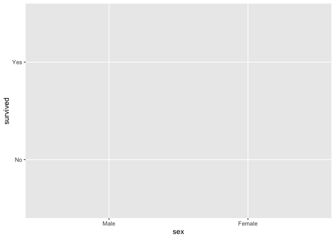
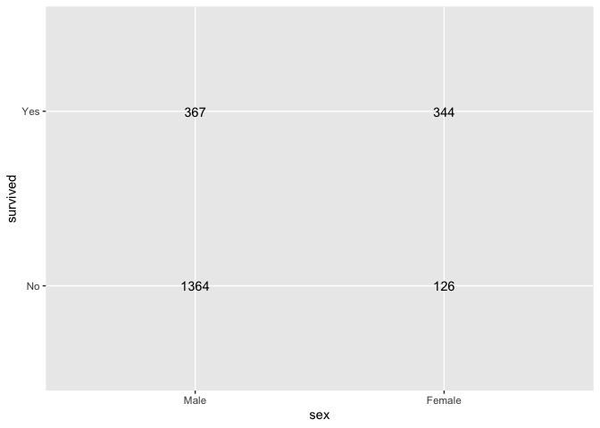

  - [{tidypivot} allows you to create tables by describing them (like
    ggplot2 plot
    description/declaration)](#tidypivot-allows-you-to-create-tables-by-describing-them-like-ggplot2-plot-descriptiondeclaration)
  - [declarative table creation with
    ggplot2](#declarative-table-creation-with-ggplot2)
      - [Status quo table creation: Harder than it should
        be?](#status-quo-table-creation-harder-than-it-should-be)
          - [pivotr function: toward declarative table
            generation](#pivotr-function-toward-declarative-table-generation)
  - [examples/derivative](#examplesderivative)
  - [filling cells with examples from
    data.](#filling-cells-with-examples-from-data)
      - [proportions helpers](#proportions-helpers)

<!-- README.md is generated from README.Rmd. Please edit that file -->

# {tidypivot} allows you to create tables by describing them (like ggplot2 plot description/declaration)

note: see original discussion here:
<https://evamaerey.github.io/mytidytuesday/2022-02-14-tables/tables.html>
and thoughtful contributions from @shannonpileggi and @brshallow
<https://github.com/EvaMaeRey/mytidytuesday/issues/3>

> And, you know, I’d get a dataset. And, *in my head I could very
> clearly kind of picture*, I want to put this on the x-axis. Let’s put
> this on the y-axis, draw a line, put some points here, break it up by
> this variable. And then, like, getting that vision out of my head, and
> into reality, it’s just really, really hard. Just, like, felt harder
> than it should be. Like, there’s a lot of custom programming involved,
> where I just felt, like, to me, I just wanted to say, like, you know,
> *this is what I’m thinking, this is how I’m picturing this plot. Like
> you’re the computer ‘Go and do it’.* … and I’d also been reading about
> the Grammar of Graphics by Leland Wilkinson, I got to meet him a
> couple of times and … I was, like, this book has been, like, written
> for me. -
> <https://www.trifacta.com/podcast/tidy-data-with-hadley-wickham/>

# declarative table creation with ggplot2

``` r
library(ggplot2)
StatSum$default_aes <- aes(label = after_stat(n))

# I want to put this on the x-axis (cols)
tidytitanic::tidy_titanic |>
  ggplot(
      # I want to put this on the x-axis (cols)
  aes(x = sex, 
      # I want to put this on the y- axis (rows)
      y = survived)
  )
```



``` r

# grouping and computation happen in one step, filling in 'table'
last_plot() + 
  stat_sum(geom = "text")
```



## Status quo table creation: Harder than it should be?

  - 1.  grouping

  - 2.  compute

  - 3.  pivot

### pivotr function: toward declarative table generation

Under the hood:

  - group by rows and columns
  - value in data to consider (1 if not specified)
  - wt, weight the value (1 if not specified)
  - fun - do an operation (on value) within group

But API:

  - describe layout of table and compute

<!-- end list -->

``` r
#' Title
#'
#' @param data 
#' @param rows 
#' @param cols 
#' @param value 
#' @param wt 
#' @param fun 
#' @param prop 
#' @param percent 
#' @param round 
#' @param within 
#' @param withinfun 
#' @param pivot 
#' @param wrap 
#' @param totals_within 
#'
#' @return
#' @export
#'
#' @examples
pivotr <- function(data,
                       rows = NULL,
                       cols = NULL,
                       value = NULL,
                       wt = NULL,
                       
                       fun = NULL,
                       
                       prop = FALSE,
                       percent = FALSE,
                       round = NULL,
                       
                       within = NULL,
                       withinfun = NULL,
                       
                       pivot = NULL,
                       wrap = NULL,
                       totals_within = NULL
){

  
    cols_quo          <- rlang::enquo(cols)
    value_quo         <- rlang::enquo(value)
    wt_quo            <- rlang::enquo(wt)
    within_quo        <- rlang::enquo(within)
    totals_within_quo <- rlang::enquo(totals_within)

    if(is.null(prop)) {prop <- FALSE}
    if(is.null(pivot)){pivot <- TRUE}
    if(is.null(wrap)) {wrap <- FALSE}

    if(is.null(fun))  {fun <- sum}

    ## adding a value as 1 if there is none
    
    if(rlang::quo_is_null(value_quo) ){

      data <- data |>
        dplyr::mutate(value = 1)
      
    }else{
      
      data <- data |> 
          dplyr::mutate(value = {{value}})
        
    }
    
    #### weighting ####
    
    if(!rlang::quo_is_null(wt_quo) ){
     
      data <- data |>
        dplyr::mutate(value = value * {{wt}}) 
   }
    
    
    ### grouping by tabulation vars col and row
    grouped <- data |>
      dplyr::group_by(dplyr::across(c({{cols}}, {{rows}})),
                      .drop = FALSE)
  
    ### summarizing ####
    
    summarized <- grouped |>
        dplyr::summarise(value = fun(value))

    # proportion case or percent
    if(prop|percent){
      
      mult <- ifelse(percent, 100, 1)
      if(is.null(round)){round <- ifelse(percent, 1, 3)}

      # prop is across all data
        if(rlang::quo_is_null(within_quo) ){

            summarized <- summarized |>
              dplyr::ungroup() |>
              dplyr::mutate(value = round(value*mult/sum(value), round))

        # prop is within categories specified by within variable
        }else{

              summarized <- summarized |>
                dplyr::ungroup() |>
                dplyr::group_by(dplyr::across(c({{within}})),
                                .drop = FALSE) |>
                dplyr::mutate(value = round(value*mult/sum(value), round))

        }
    }

    arranged <- summarized

    ungrouped <- arranged |>
      dplyr::ungroup()

    tidy <- ungrouped

    # do not pivot if argument pivot false or if no columns specified
    if(pivot == F | rlang::quo_is_null(cols_quo)){

      tidy
      # tidy |>
      #   dplyr::rename(count = .data$value)

      # otherwise pivot by columns
    }else{

      tidy |>
        tidyr::pivot_wider(names_from = {{cols}})

    }

  }
```

``` r
library(tidytitanic)

tidy_titanic |> pivotr()
#> # A tibble: 1 × 1
#>   value
#>   <dbl>
#> 1  2201

tidy_titanic |> pivotr(rows = sex, cols = survived)
#> # A tibble: 2 × 3
#>   sex       No   Yes
#>   <fct>  <dbl> <dbl>
#> 1 Male    1364   367
#> 2 Female   126   344

tidy_titanic |> pivotr(rows = c(sex, age), cols = survived)
#> # A tibble: 4 × 4
#>   sex    age      No   Yes
#>   <fct>  <fct> <dbl> <dbl>
#> 1 Male   Child    35    29
#> 2 Male   Adult  1329   338
#> 3 Female Child    17    28
#> 4 Female Adult   109   316

tidy_titanic |> pivotr(rows = sex, cols = survived, pivot = F)
#> # A tibble: 4 × 3
#>   survived sex    value
#>   <fct>    <fct>  <dbl>
#> 1 No       Male    1364
#> 2 No       Female   126
#> 3 Yes      Male     367
#> 4 Yes      Female   344

flat_titanic |> pivotr(rows = sex, value = freq, prop = TRUE)
#> # A tibble: 2 × 2
#>   sex    value
#>   <fct>  <dbl>
#> 1 Male   0.786
#> 2 Female 0.214

flat_titanic |> pivotr(rows = sex, cols = survived, value = freq, prop = TRUE)
#> # A tibble: 2 × 3
#>   sex       No   Yes
#>   <fct>  <dbl> <dbl>
#> 1 Male   0.62  0.167
#> 2 Female 0.057 0.156

flat_titanic |> pivotr(rows = sex, cols = survived, value = freq, prop = TRUE, within = sex)
#> # A tibble: 2 × 3
#>   sex       No   Yes
#>   <fct>  <dbl> <dbl>
#> 1 Male   0.788 0.212
#> 2 Female 0.268 0.732
```

# examples/derivative

Here are some examples where you might have derivative functions

``` r
pivot_count <- function(...){

  # maybe a wt version...
  pivotr(fun = length, ...) 

  }

pivot_average <- function(...){
  
  mean_na_rm <- function(x){mean(x, na.rm = T)}
  
  pivotr(fun = mean_na_rm, ...) 
  
}

pivot_sum <- function(...){
  
  pivotr(fun = sum, ...)
  
}

pivot_empty <- function(...){
  
nar <- function(x) return(NA)

  pivotr(fun = nar, ...)

}
```

``` r
library(magrittr)
library(tidytitanic)

passengers <- readr::read_csv("https://raw.githubusercontent.com/clauswilke/dviz.supp/master/data-raw/titanic/Titanic.csv")

head(passengers)
#> # A tibble: 6 × 7
#>    ...1 Name                                 PClass   Age Sex   Survived SexCode
#>   <dbl> <chr>                                <chr>  <dbl> <chr>    <dbl>   <dbl>
#> 1     1 Allen, Miss Elisabeth Walton         1st    29    fema…        1       1
#> 2     2 Allison, Miss Helen Loraine          1st     2    fema…        0       1
#> 3     3 Allison, Mr Hudson Joshua Creighton  1st    30    male         0       0
#> 4     4 Allison, Mrs Hudson JC (Bessie Wald… 1st    25    fema…        0       1
#> 5     5 Allison, Master Hudson Trevor        1st     0.92 male         1       0
#> 6     6 Anderson, Mr Harry                   1st    47    male         1       0

tidy_titanic |> pivot_count(rows = sex)
#> # A tibble: 2 × 2
#>   sex    value
#>   <fct>  <int>
#> 1 Male    1731
#> 2 Female   470
tidy_titanic |> pivot_count(rows = sex, col = survived)
#> # A tibble: 2 × 3
#>   sex       No   Yes
#>   <fct>  <int> <int>
#> 1 Male    1364   367
#> 2 Female   126   344
flat_titanic |> pivot_sum(rows = survived, value = freq)
#> # A tibble: 2 × 2
#>   survived value
#>   <fct>    <dbl>
#> 1 No        1490
#> 2 Yes        711
flat_titanic |> pivot_sum(rows = sex,  cols = survived, value = freq)
#> # A tibble: 2 × 3
#>   sex       No   Yes
#>   <fct>  <dbl> <dbl>
#> 1 Male    1364   367
#> 2 Female   126   344

flat_titanic |> pivot_average(rows = sex,  cols = survived, value = freq)
#> # A tibble: 2 × 3
#>   sex       No   Yes
#>   <fct>  <dbl> <dbl>
#> 1 Male   170.   45.9
#> 2 Female  15.8  43
flat_titanic |> pivot_empty(rows = survived, cols = age)
#> # A tibble: 2 × 3
#>   survived Child Adult
#>   <fct>    <lgl> <lgl>
#> 1 No       NA    NA   
#> 2 Yes      NA    NA

passengers |> pivot_average(rows = c(Sex, PClass), cols = Survived, value = Age)
#> # A tibble: 7 × 4
#>   Sex    PClass   `0`   `1`
#>   <chr>  <chr>  <dbl> <dbl>
#> 1 female 1st     35.2  37.9
#> 2 female 2nd     31.4  26.9
#> 3 female 3rd     22.8  22.7
#> 4 male   *      NaN    NA  
#> 5 male   1st     44.8  34.3
#> 6 male   2nd     31.7  14.8
#> 7 male   3rd     27.1  22.1
```

# filling cells with examples from data.

``` r
pivot_example <- function(...){

  sample1 <- function(x) sample(x, 1)
  pivotr(fun = sample1, ...)

}


pivot_samplen <- function(..., n = 3, sep = "; "){

  samplen <- function(x) paste(sample(x, n, replace = F), collapse = sep)

  pivotr(fun = samplen, ...) 

}

pivot_list <- function(..., sep = "; "){

  paste_collapse <- function(x) paste (x, collapse = sep)
  pivotr(fun = paste_collapse, ...) 
  
}
```

``` r
flat_titanic |> pivot_example(rows = sex, value = freq)
#> # A tibble: 2 × 2
#>   sex    value
#>   <fct>  <dbl>
#> 1 Male       0
#> 2 Female   140

flat_titanic |> pivot_samplen(rows = sex, value = freq)
#> # A tibble: 2 × 2
#>   sex    value      
#>   <fct>  <chr>      
#> 1 Male   5; 670; 387
#> 2 Female 13; 80; 13

flat_titanic |> pivot_list(rows = sex, cols = survived, value = freq)
#> # A tibble: 2 × 3
#>   sex    No                              Yes                          
#>   <fct>  <chr>                           <chr>                        
#> 1 Male   0; 0; 35; 0; 118; 154; 387; 670 5; 11; 13; 0; 57; 14; 75; 192
#> 2 Female 0; 0; 17; 0; 4; 13; 89; 3       1; 13; 14; 0; 140; 80; 76; 20

set.seed(12345)
passengers |> pivot_example(rows = Sex, value = Name)
#> # A tibble: 2 × 2
#>   Sex    value                        
#>   <chr>  <chr>                        
#> 1 female Ward, Ms Anna                
#> 2 male   Duff Gordon, Sir Cosmo Edmund
passengers |> pivot_samplen(rows = Sex, cols = Survived, value = Name, n = 2, sep = "; ") 
#> # A tibble: 2 × 3
#>   Sex    `0`                                                   `1`              
#>   <chr>  <chr>                                                 <chr>            
#> 1 female Vestrom, Miss Hulda Amanda Adolfina; Healy, Miss Nora Ware, Mrs John J…
#> 2 male   Rosblom, Mr Viktor Rickard; Petroff, Mr Pentcho       Abrahamsson, Mr …

passengers |> pivot_samplen(rows = Sex, cols = Survived, value = Age, n = 5) 
#> # A tibble: 2 × 3
#>   Sex    `0`                `1`               
#>   <chr>  <chr>              <chr>             
#> 1 female NA; NA; NA; 44; 20 59; 12; 13; 26; NA
#> 2 male   20; 22; NA; 48; NA NA; NA; 0.8; 34; 1

passengers |> dplyr::sample_n(20) |> pivot_list(rows = Sex, cols = Survived, value = Age)
#> # A tibble: 2 × 3
#>   Sex    `0`                                                `1`       
#>   <chr>  <chr>                                              <chr>     
#> 1 female NA; NA                                             15; NA; 45
#> 2 male   20; 30; NA; NA; NA; NA; NA; 26; 29; 21; NA; 19; 46 19; 2
```

## proportions helpers

``` r
library(tidytitanic)
# pivot_prop
flat_titanic |> pivotr(rows = sex, value = freq, prop = TRUE) # pivot_prop
#> # A tibble: 2 × 2
#>   sex    value
#>   <fct>  <dbl>
#> 1 Male   0.786
#> 2 Female 0.214
flat_titanic |> pivotr(rows = sex, cols = survived, value = freq, prop = TRUE)
#> # A tibble: 2 × 3
#>   sex       No   Yes
#>   <fct>  <dbl> <dbl>
#> 1 Male   0.62  0.167
#> 2 Female 0.057 0.156
flat_titanic |> pivotr(rows = sex, cols = survived, value = freq, prop = TRUE, within = sex)
#> # A tibble: 2 × 3
#>   sex       No   Yes
#>   <fct>  <dbl> <dbl>
#> 1 Male   0.788 0.212
#> 2 Female 0.268 0.732

# pivot_percent
flat_titanic |> pivotr(rows = sex, cols = survived, value = freq, percent = TRUE, within = sex)
#> # A tibble: 2 × 3
#>   sex       No   Yes
#>   <fct>  <dbl> <dbl>
#> 1 Male    78.8  21.2
#> 2 Female  26.8  73.2
```

``` r
knitr::knit_exit()
```
