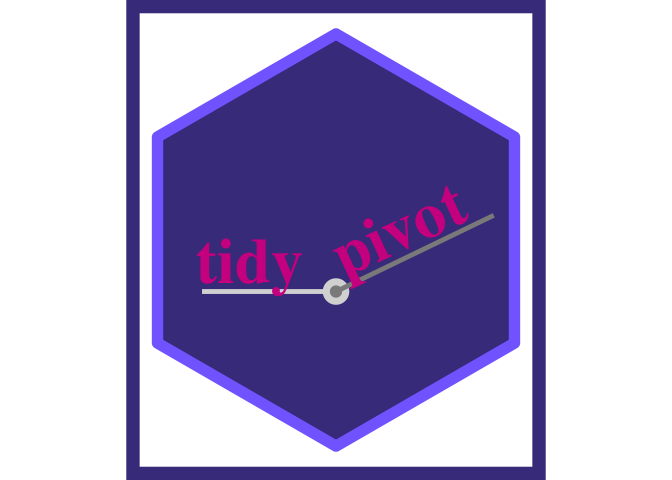

<!-- README.md is generated from README.Rmd. Please edit that file -->

``` r
knitr::opts_chunk$set(message = F, warning = F)
```

# Step 00. prep some data, records and flat

``` r
library(tidyverse)
library(magrittr)

Titanic %>% 
  data.frame() %>% 
  uncount(weights = Freq) ->
tidy_titanic ; tidy_titanic %>% head()
#>     Class  Sex   Age Survived
#> 3     3rd Male Child       No
#> 3.1   3rd Male Child       No
#> 3.2   3rd Male Child       No
#> 3.3   3rd Male Child       No
#> 3.4   3rd Male Child       No
#> 3.5   3rd Male Child       No

Titanic %>% 
  data.frame() ->
flat_titanic ; flat_titanic %>% head()
#>   Class    Sex   Age Survived Freq
#> 1   1st   Male Child       No    0
#> 2   2nd   Male Child       No    0
#> 3   3rd   Male Child       No   35
#> 4  Crew   Male Child       No    0
#> 5   1st Female Child       No    0
#> 6   2nd Female Child       No    0
```

------------------------------------------------------------------------

# Step 0. Some observations

## ggplot2: user needs to describe layout of table

you can make a visual pivot table in ggplot2; analyst job is to describe
the form. How will it look

specify 3 things - start with visual layout

-   specify x
-   specify y
-   specify count type geom

``` r
tidy_titanic %>% 
  ggplot() + 
  aes(x = Sex, y = Survived) + 
  geom_jitter() + 
  geom_count(color = "blue")
```


------------------------------------------------------------------------

## With existing pivot tools, description isn’t so visual

-   specify vars
-   specify aggregation
-   specify visual arrangement (names from?) &lt;- this comes last

``` r
tidy_titanic %>% 
  group_by(Sex, Survived) %>% 
  summarize(value = n()) %>% 
  pivot_wider(names_from = Survived)
#> # A tibble: 2 × 3
#> # Groups:   Sex [2]
#>   Sex       No   Yes
#>   <fct>  <int> <int>
#> 1 Male    1364   367
#> 2 Female   126   344
```

------------------------------------------------------------------------

# Step 1a. Make Functions to allow description of final table, pivot\_count and pivot\_calc

## x argument is horizontal elements (columns) and y is vertical elements (rows)

``` r
pivot_count <- function(data, y, y0, y00, x = NULL, 
                          value = NULL, 
                          fun = sum, 
                          pivot = T #ifelse(is.null(x),F,T)
                          ){
  
  y00 <- enquo(y00)
  y0 <- enquo(y0)
  y <- enquo(y)
  x <- enquo(x)

    data <- data %>% mutate(count = 1)
  
tidy <- data %>% 
  group_by(!!y00, !!y0, !!y, !!x) %>% 
  summarize(value = fun(count)) %>% 
  ungroup()
  
  if(pivot){#or x is null
  tidy %>% 
    pivot_wider(names_from = !!x)
  }else{
  tidy
  }

}
```

``` r
pivot_calc <- function(data, y, y0, y00, x = NULL, 
                          value, 
                          fun = sum, 
                          pivot = T #ifelse(is.null(x),F,T)
                          ){
  
  y00 <- enquo(y00)
  y0 <- enquo(y0)
  y <- enquo(y)
  x <- enquo(x)
  value <- enquo(value)
  
tidy <- data %>% 
  group_by(!!y00, !!y0, !!y, !!x) %>% 
  summarize(value = fun(!!value)) %>% 
  ungroup()
  
  if(pivot){#or x is null
  tidy %>% 
    pivot_wider(names_from = !!x)
  }else{
  tidy
  }

}
```

# Step 1b. Using those functions

``` r
tidy_titanic %>% 
   pivot_count(x = Sex)
#> # A tibble: 1 × 2
#>    Male Female
#>   <dbl>  <dbl>
#> 1  1731    470

tidy_titanic %>% 
  pivot_count(y = Survived, x = Sex) 
#> # A tibble: 2 × 3
#>   Survived  Male Female
#>   <fct>    <dbl>  <dbl>
#> 1 No        1364    126
#> 2 Yes        367    344

tidy_titanic %>% 
  pivot_count(y = Survived, x = Sex, y0 = Class)
#> # A tibble: 8 × 4
#>   Class Survived  Male Female
#>   <fct> <fct>    <dbl>  <dbl>
#> 1 1st   No         118      4
#> 2 1st   Yes         62    141
#> 3 2nd   No         154     13
#> 4 2nd   Yes         25     93
#> 5 3rd   No         422    106
#> 6 3rd   Yes         88     90
#> 7 Crew  No         670      3
#> 8 Crew  Yes        192     20

# for fun organize like it will appear visually in code
tidy_titanic %>% 
  pivot_count(                          x = Sex, 
              y0 = Class, y = Survived          )
#> # A tibble: 8 × 4
#>   Class Survived  Male Female
#>   <fct> <fct>    <dbl>  <dbl>
#> 1 1st   No         118      4
#> 2 1st   Yes         62    141
#> 3 2nd   No         154     13
#> 4 2nd   Yes         25     93
#> 5 3rd   No         422    106
#> 6 3rd   Yes         88     90
#> 7 Crew  No         670      3
#> 8 Crew  Yes        192     20
```

## After designing your table you might actually want to have the calculation in long form.

``` r
tidy_titanic %>% 
  pivot_count(x = Sex, y = Survived, pivot = F)
#> # A tibble: 4 × 3
#>   Survived Sex    value
#>   <fct>    <fct>  <dbl>
#> 1 No       Male    1364
#> 2 No       Female   126
#> 3 Yes      Male     367
#> 4 Yes      Female   344
```

## 1b. pivot\_calc using pivot calc function for non count aggregation

### just for fun arrange the code how the table will look

``` r
flat_titanic %>%
  pivot_calc(              x = Sex, 
             y = Survived, value = Freq, fun = sum)
#> # A tibble: 2 × 3
#>   Survived  Male Female
#>   <fct>    <dbl>  <dbl>
#> 1 No        1364    126
#> 2 Yes        367    344
```

## 1b style. use another tool to style

### goal of functions is not to style - just to make calculation faster by using a visually driven API

``` r
tidy_titanic %>% 
  pivot_count(x = Sex, y = Survived, y0 = Class) %>% 
  group_by(Class) %>% 
  gt::gt()
```

<div id="epqlcixhbi" style="overflow-x:auto;overflow-y:auto;width:auto;height:auto;">
<style>html {
  font-family: -apple-system, BlinkMacSystemFont, 'Segoe UI', Roboto, Oxygen, Ubuntu, Cantarell, 'Helvetica Neue', 'Fira Sans', 'Droid Sans', Arial, sans-serif;
}

#epqlcixhbi .gt_table {
  display: table;
  border-collapse: collapse;
  margin-left: auto;
  margin-right: auto;
  color: #333333;
  font-size: 16px;
  font-weight: normal;
  font-style: normal;
  background-color: #FFFFFF;
  width: auto;
  border-top-style: solid;
  border-top-width: 2px;
  border-top-color: #A8A8A8;
  border-right-style: none;
  border-right-width: 2px;
  border-right-color: #D3D3D3;
  border-bottom-style: solid;
  border-bottom-width: 2px;
  border-bottom-color: #A8A8A8;
  border-left-style: none;
  border-left-width: 2px;
  border-left-color: #D3D3D3;
}

#epqlcixhbi .gt_heading {
  background-color: #FFFFFF;
  text-align: center;
  border-bottom-color: #FFFFFF;
  border-left-style: none;
  border-left-width: 1px;
  border-left-color: #D3D3D3;
  border-right-style: none;
  border-right-width: 1px;
  border-right-color: #D3D3D3;
}

#epqlcixhbi .gt_title {
  color: #333333;
  font-size: 125%;
  font-weight: initial;
  padding-top: 4px;
  padding-bottom: 4px;
  padding-left: 5px;
  padding-right: 5px;
  border-bottom-color: #FFFFFF;
  border-bottom-width: 0;
}

#epqlcixhbi .gt_subtitle {
  color: #333333;
  font-size: 85%;
  font-weight: initial;
  padding-top: 0;
  padding-bottom: 6px;
  padding-left: 5px;
  padding-right: 5px;
  border-top-color: #FFFFFF;
  border-top-width: 0;
}

#epqlcixhbi .gt_bottom_border {
  border-bottom-style: solid;
  border-bottom-width: 2px;
  border-bottom-color: #D3D3D3;
}

#epqlcixhbi .gt_col_headings {
  border-top-style: solid;
  border-top-width: 2px;
  border-top-color: #D3D3D3;
  border-bottom-style: solid;
  border-bottom-width: 2px;
  border-bottom-color: #D3D3D3;
  border-left-style: none;
  border-left-width: 1px;
  border-left-color: #D3D3D3;
  border-right-style: none;
  border-right-width: 1px;
  border-right-color: #D3D3D3;
}

#epqlcixhbi .gt_col_heading {
  color: #333333;
  background-color: #FFFFFF;
  font-size: 100%;
  font-weight: normal;
  text-transform: inherit;
  border-left-style: none;
  border-left-width: 1px;
  border-left-color: #D3D3D3;
  border-right-style: none;
  border-right-width: 1px;
  border-right-color: #D3D3D3;
  vertical-align: bottom;
  padding-top: 5px;
  padding-bottom: 6px;
  padding-left: 5px;
  padding-right: 5px;
  overflow-x: hidden;
}

#epqlcixhbi .gt_column_spanner_outer {
  color: #333333;
  background-color: #FFFFFF;
  font-size: 100%;
  font-weight: normal;
  text-transform: inherit;
  padding-top: 0;
  padding-bottom: 0;
  padding-left: 4px;
  padding-right: 4px;
}

#epqlcixhbi .gt_column_spanner_outer:first-child {
  padding-left: 0;
}

#epqlcixhbi .gt_column_spanner_outer:last-child {
  padding-right: 0;
}

#epqlcixhbi .gt_column_spanner {
  border-bottom-style: solid;
  border-bottom-width: 2px;
  border-bottom-color: #D3D3D3;
  vertical-align: bottom;
  padding-top: 5px;
  padding-bottom: 5px;
  overflow-x: hidden;
  display: inline-block;
  width: 100%;
}

#epqlcixhbi .gt_group_heading {
  padding-top: 8px;
  padding-bottom: 8px;
  padding-left: 5px;
  padding-right: 5px;
  color: #333333;
  background-color: #FFFFFF;
  font-size: 100%;
  font-weight: initial;
  text-transform: inherit;
  border-top-style: solid;
  border-top-width: 2px;
  border-top-color: #D3D3D3;
  border-bottom-style: solid;
  border-bottom-width: 2px;
  border-bottom-color: #D3D3D3;
  border-left-style: none;
  border-left-width: 1px;
  border-left-color: #D3D3D3;
  border-right-style: none;
  border-right-width: 1px;
  border-right-color: #D3D3D3;
  vertical-align: middle;
}

#epqlcixhbi .gt_empty_group_heading {
  padding: 0.5px;
  color: #333333;
  background-color: #FFFFFF;
  font-size: 100%;
  font-weight: initial;
  border-top-style: solid;
  border-top-width: 2px;
  border-top-color: #D3D3D3;
  border-bottom-style: solid;
  border-bottom-width: 2px;
  border-bottom-color: #D3D3D3;
  vertical-align: middle;
}

#epqlcixhbi .gt_from_md > :first-child {
  margin-top: 0;
}

#epqlcixhbi .gt_from_md > :last-child {
  margin-bottom: 0;
}

#epqlcixhbi .gt_row {
  padding-top: 8px;
  padding-bottom: 8px;
  padding-left: 5px;
  padding-right: 5px;
  margin: 10px;
  border-top-style: solid;
  border-top-width: 1px;
  border-top-color: #D3D3D3;
  border-left-style: none;
  border-left-width: 1px;
  border-left-color: #D3D3D3;
  border-right-style: none;
  border-right-width: 1px;
  border-right-color: #D3D3D3;
  vertical-align: middle;
  overflow-x: hidden;
}

#epqlcixhbi .gt_stub {
  color: #333333;
  background-color: #FFFFFF;
  font-size: 100%;
  font-weight: initial;
  text-transform: inherit;
  border-right-style: solid;
  border-right-width: 2px;
  border-right-color: #D3D3D3;
  padding-left: 5px;
  padding-right: 5px;
}

#epqlcixhbi .gt_stub_row_group {
  color: #333333;
  background-color: #FFFFFF;
  font-size: 100%;
  font-weight: initial;
  text-transform: inherit;
  border-right-style: solid;
  border-right-width: 2px;
  border-right-color: #D3D3D3;
  padding-left: 5px;
  padding-right: 5px;
  vertical-align: top;
}

#epqlcixhbi .gt_row_group_first td {
  border-top-width: 2px;
}

#epqlcixhbi .gt_summary_row {
  color: #333333;
  background-color: #FFFFFF;
  text-transform: inherit;
  padding-top: 8px;
  padding-bottom: 8px;
  padding-left: 5px;
  padding-right: 5px;
}

#epqlcixhbi .gt_first_summary_row {
  border-top-style: solid;
  border-top-color: #D3D3D3;
}

#epqlcixhbi .gt_first_summary_row.thick {
  border-top-width: 2px;
}

#epqlcixhbi .gt_last_summary_row {
  padding-top: 8px;
  padding-bottom: 8px;
  padding-left: 5px;
  padding-right: 5px;
  border-bottom-style: solid;
  border-bottom-width: 2px;
  border-bottom-color: #D3D3D3;
}

#epqlcixhbi .gt_grand_summary_row {
  color: #333333;
  background-color: #FFFFFF;
  text-transform: inherit;
  padding-top: 8px;
  padding-bottom: 8px;
  padding-left: 5px;
  padding-right: 5px;
}

#epqlcixhbi .gt_first_grand_summary_row {
  padding-top: 8px;
  padding-bottom: 8px;
  padding-left: 5px;
  padding-right: 5px;
  border-top-style: double;
  border-top-width: 6px;
  border-top-color: #D3D3D3;
}

#epqlcixhbi .gt_striped {
  background-color: rgba(128, 128, 128, 0.05);
}

#epqlcixhbi .gt_table_body {
  border-top-style: solid;
  border-top-width: 2px;
  border-top-color: #D3D3D3;
  border-bottom-style: solid;
  border-bottom-width: 2px;
  border-bottom-color: #D3D3D3;
}

#epqlcixhbi .gt_footnotes {
  color: #333333;
  background-color: #FFFFFF;
  border-bottom-style: none;
  border-bottom-width: 2px;
  border-bottom-color: #D3D3D3;
  border-left-style: none;
  border-left-width: 2px;
  border-left-color: #D3D3D3;
  border-right-style: none;
  border-right-width: 2px;
  border-right-color: #D3D3D3;
}

#epqlcixhbi .gt_footnote {
  margin: 0px;
  font-size: 90%;
  padding-left: 4px;
  padding-right: 4px;
  padding-left: 5px;
  padding-right: 5px;
}

#epqlcixhbi .gt_sourcenotes {
  color: #333333;
  background-color: #FFFFFF;
  border-bottom-style: none;
  border-bottom-width: 2px;
  border-bottom-color: #D3D3D3;
  border-left-style: none;
  border-left-width: 2px;
  border-left-color: #D3D3D3;
  border-right-style: none;
  border-right-width: 2px;
  border-right-color: #D3D3D3;
}

#epqlcixhbi .gt_sourcenote {
  font-size: 90%;
  padding-top: 4px;
  padding-bottom: 4px;
  padding-left: 5px;
  padding-right: 5px;
}

#epqlcixhbi .gt_left {
  text-align: left;
}

#epqlcixhbi .gt_center {
  text-align: center;
}

#epqlcixhbi .gt_right {
  text-align: right;
  font-variant-numeric: tabular-nums;
}

#epqlcixhbi .gt_font_normal {
  font-weight: normal;
}

#epqlcixhbi .gt_font_bold {
  font-weight: bold;
}

#epqlcixhbi .gt_font_italic {
  font-style: italic;
}

#epqlcixhbi .gt_super {
  font-size: 65%;
}

#epqlcixhbi .gt_footnote_marks {
  font-style: italic;
  font-weight: normal;
  font-size: 75%;
  vertical-align: 0.4em;
}

#epqlcixhbi .gt_asterisk {
  font-size: 100%;
  vertical-align: 0;
}

#epqlcixhbi .gt_slash_mark {
  font-size: 0.7em;
  line-height: 0.7em;
  vertical-align: 0.15em;
}

#epqlcixhbi .gt_fraction_numerator {
  font-size: 0.6em;
  line-height: 0.6em;
  vertical-align: 0.45em;
}

#epqlcixhbi .gt_fraction_denominator {
  font-size: 0.6em;
  line-height: 0.6em;
  vertical-align: -0.05em;
}
</style>
<table class="gt_table">
  
  <thead class="gt_col_headings">
    <tr>
      <th class="gt_col_heading gt_columns_bottom_border gt_center" rowspan="1" colspan="1">Survived</th>
      <th class="gt_col_heading gt_columns_bottom_border gt_right" rowspan="1" colspan="1">Male</th>
      <th class="gt_col_heading gt_columns_bottom_border gt_right" rowspan="1" colspan="1">Female</th>
    </tr>
  </thead>
  <tbody class="gt_table_body">
    <tr class="gt_group_heading_row">
      <td colspan="3" class="gt_group_heading">1st</td>
    </tr>
    <tr class="gt_row_group_first"><td class="gt_row gt_center">No</td>
<td class="gt_row gt_right">118</td>
<td class="gt_row gt_right">4</td></tr>
    <tr><td class="gt_row gt_center">Yes</td>
<td class="gt_row gt_right">62</td>
<td class="gt_row gt_right">141</td></tr>
    <tr class="gt_group_heading_row">
      <td colspan="3" class="gt_group_heading">2nd</td>
    </tr>
    <tr class="gt_row_group_first"><td class="gt_row gt_center">No</td>
<td class="gt_row gt_right">154</td>
<td class="gt_row gt_right">13</td></tr>
    <tr><td class="gt_row gt_center">Yes</td>
<td class="gt_row gt_right">25</td>
<td class="gt_row gt_right">93</td></tr>
    <tr class="gt_group_heading_row">
      <td colspan="3" class="gt_group_heading">3rd</td>
    </tr>
    <tr class="gt_row_group_first"><td class="gt_row gt_center">No</td>
<td class="gt_row gt_right">422</td>
<td class="gt_row gt_right">106</td></tr>
    <tr><td class="gt_row gt_center">Yes</td>
<td class="gt_row gt_right">88</td>
<td class="gt_row gt_right">90</td></tr>
    <tr class="gt_group_heading_row">
      <td colspan="3" class="gt_group_heading">Crew</td>
    </tr>
    <tr class="gt_row_group_first"><td class="gt_row gt_center">No</td>
<td class="gt_row gt_right">670</td>
<td class="gt_row gt_right">3</td></tr>
    <tr><td class="gt_row gt_center">Yes</td>
<td class="gt_row gt_right">192</td>
<td class="gt_row gt_right">20</td></tr>
  </tbody>
  
  
</table>
</div>

# 

``` r
tidy_titanic %>% 
  pivot_count(x = Sex, y = Survived, y0 = Class, y00 = Age) %>% 
  group_by(Age) %>% 
  gt::gt()
```

<div id="cekssclpht" style="overflow-x:auto;overflow-y:auto;width:auto;height:auto;">
<style>html {
  font-family: -apple-system, BlinkMacSystemFont, 'Segoe UI', Roboto, Oxygen, Ubuntu, Cantarell, 'Helvetica Neue', 'Fira Sans', 'Droid Sans', Arial, sans-serif;
}

#cekssclpht .gt_table {
  display: table;
  border-collapse: collapse;
  margin-left: auto;
  margin-right: auto;
  color: #333333;
  font-size: 16px;
  font-weight: normal;
  font-style: normal;
  background-color: #FFFFFF;
  width: auto;
  border-top-style: solid;
  border-top-width: 2px;
  border-top-color: #A8A8A8;
  border-right-style: none;
  border-right-width: 2px;
  border-right-color: #D3D3D3;
  border-bottom-style: solid;
  border-bottom-width: 2px;
  border-bottom-color: #A8A8A8;
  border-left-style: none;
  border-left-width: 2px;
  border-left-color: #D3D3D3;
}

#cekssclpht .gt_heading {
  background-color: #FFFFFF;
  text-align: center;
  border-bottom-color: #FFFFFF;
  border-left-style: none;
  border-left-width: 1px;
  border-left-color: #D3D3D3;
  border-right-style: none;
  border-right-width: 1px;
  border-right-color: #D3D3D3;
}

#cekssclpht .gt_title {
  color: #333333;
  font-size: 125%;
  font-weight: initial;
  padding-top: 4px;
  padding-bottom: 4px;
  padding-left: 5px;
  padding-right: 5px;
  border-bottom-color: #FFFFFF;
  border-bottom-width: 0;
}

#cekssclpht .gt_subtitle {
  color: #333333;
  font-size: 85%;
  font-weight: initial;
  padding-top: 0;
  padding-bottom: 6px;
  padding-left: 5px;
  padding-right: 5px;
  border-top-color: #FFFFFF;
  border-top-width: 0;
}

#cekssclpht .gt_bottom_border {
  border-bottom-style: solid;
  border-bottom-width: 2px;
  border-bottom-color: #D3D3D3;
}

#cekssclpht .gt_col_headings {
  border-top-style: solid;
  border-top-width: 2px;
  border-top-color: #D3D3D3;
  border-bottom-style: solid;
  border-bottom-width: 2px;
  border-bottom-color: #D3D3D3;
  border-left-style: none;
  border-left-width: 1px;
  border-left-color: #D3D3D3;
  border-right-style: none;
  border-right-width: 1px;
  border-right-color: #D3D3D3;
}

#cekssclpht .gt_col_heading {
  color: #333333;
  background-color: #FFFFFF;
  font-size: 100%;
  font-weight: normal;
  text-transform: inherit;
  border-left-style: none;
  border-left-width: 1px;
  border-left-color: #D3D3D3;
  border-right-style: none;
  border-right-width: 1px;
  border-right-color: #D3D3D3;
  vertical-align: bottom;
  padding-top: 5px;
  padding-bottom: 6px;
  padding-left: 5px;
  padding-right: 5px;
  overflow-x: hidden;
}

#cekssclpht .gt_column_spanner_outer {
  color: #333333;
  background-color: #FFFFFF;
  font-size: 100%;
  font-weight: normal;
  text-transform: inherit;
  padding-top: 0;
  padding-bottom: 0;
  padding-left: 4px;
  padding-right: 4px;
}

#cekssclpht .gt_column_spanner_outer:first-child {
  padding-left: 0;
}

#cekssclpht .gt_column_spanner_outer:last-child {
  padding-right: 0;
}

#cekssclpht .gt_column_spanner {
  border-bottom-style: solid;
  border-bottom-width: 2px;
  border-bottom-color: #D3D3D3;
  vertical-align: bottom;
  padding-top: 5px;
  padding-bottom: 5px;
  overflow-x: hidden;
  display: inline-block;
  width: 100%;
}

#cekssclpht .gt_group_heading {
  padding-top: 8px;
  padding-bottom: 8px;
  padding-left: 5px;
  padding-right: 5px;
  color: #333333;
  background-color: #FFFFFF;
  font-size: 100%;
  font-weight: initial;
  text-transform: inherit;
  border-top-style: solid;
  border-top-width: 2px;
  border-top-color: #D3D3D3;
  border-bottom-style: solid;
  border-bottom-width: 2px;
  border-bottom-color: #D3D3D3;
  border-left-style: none;
  border-left-width: 1px;
  border-left-color: #D3D3D3;
  border-right-style: none;
  border-right-width: 1px;
  border-right-color: #D3D3D3;
  vertical-align: middle;
}

#cekssclpht .gt_empty_group_heading {
  padding: 0.5px;
  color: #333333;
  background-color: #FFFFFF;
  font-size: 100%;
  font-weight: initial;
  border-top-style: solid;
  border-top-width: 2px;
  border-top-color: #D3D3D3;
  border-bottom-style: solid;
  border-bottom-width: 2px;
  border-bottom-color: #D3D3D3;
  vertical-align: middle;
}

#cekssclpht .gt_from_md > :first-child {
  margin-top: 0;
}

#cekssclpht .gt_from_md > :last-child {
  margin-bottom: 0;
}

#cekssclpht .gt_row {
  padding-top: 8px;
  padding-bottom: 8px;
  padding-left: 5px;
  padding-right: 5px;
  margin: 10px;
  border-top-style: solid;
  border-top-width: 1px;
  border-top-color: #D3D3D3;
  border-left-style: none;
  border-left-width: 1px;
  border-left-color: #D3D3D3;
  border-right-style: none;
  border-right-width: 1px;
  border-right-color: #D3D3D3;
  vertical-align: middle;
  overflow-x: hidden;
}

#cekssclpht .gt_stub {
  color: #333333;
  background-color: #FFFFFF;
  font-size: 100%;
  font-weight: initial;
  text-transform: inherit;
  border-right-style: solid;
  border-right-width: 2px;
  border-right-color: #D3D3D3;
  padding-left: 5px;
  padding-right: 5px;
}

#cekssclpht .gt_stub_row_group {
  color: #333333;
  background-color: #FFFFFF;
  font-size: 100%;
  font-weight: initial;
  text-transform: inherit;
  border-right-style: solid;
  border-right-width: 2px;
  border-right-color: #D3D3D3;
  padding-left: 5px;
  padding-right: 5px;
  vertical-align: top;
}

#cekssclpht .gt_row_group_first td {
  border-top-width: 2px;
}

#cekssclpht .gt_summary_row {
  color: #333333;
  background-color: #FFFFFF;
  text-transform: inherit;
  padding-top: 8px;
  padding-bottom: 8px;
  padding-left: 5px;
  padding-right: 5px;
}

#cekssclpht .gt_first_summary_row {
  border-top-style: solid;
  border-top-color: #D3D3D3;
}

#cekssclpht .gt_first_summary_row.thick {
  border-top-width: 2px;
}

#cekssclpht .gt_last_summary_row {
  padding-top: 8px;
  padding-bottom: 8px;
  padding-left: 5px;
  padding-right: 5px;
  border-bottom-style: solid;
  border-bottom-width: 2px;
  border-bottom-color: #D3D3D3;
}

#cekssclpht .gt_grand_summary_row {
  color: #333333;
  background-color: #FFFFFF;
  text-transform: inherit;
  padding-top: 8px;
  padding-bottom: 8px;
  padding-left: 5px;
  padding-right: 5px;
}

#cekssclpht .gt_first_grand_summary_row {
  padding-top: 8px;
  padding-bottom: 8px;
  padding-left: 5px;
  padding-right: 5px;
  border-top-style: double;
  border-top-width: 6px;
  border-top-color: #D3D3D3;
}

#cekssclpht .gt_striped {
  background-color: rgba(128, 128, 128, 0.05);
}

#cekssclpht .gt_table_body {
  border-top-style: solid;
  border-top-width: 2px;
  border-top-color: #D3D3D3;
  border-bottom-style: solid;
  border-bottom-width: 2px;
  border-bottom-color: #D3D3D3;
}

#cekssclpht .gt_footnotes {
  color: #333333;
  background-color: #FFFFFF;
  border-bottom-style: none;
  border-bottom-width: 2px;
  border-bottom-color: #D3D3D3;
  border-left-style: none;
  border-left-width: 2px;
  border-left-color: #D3D3D3;
  border-right-style: none;
  border-right-width: 2px;
  border-right-color: #D3D3D3;
}

#cekssclpht .gt_footnote {
  margin: 0px;
  font-size: 90%;
  padding-left: 4px;
  padding-right: 4px;
  padding-left: 5px;
  padding-right: 5px;
}

#cekssclpht .gt_sourcenotes {
  color: #333333;
  background-color: #FFFFFF;
  border-bottom-style: none;
  border-bottom-width: 2px;
  border-bottom-color: #D3D3D3;
  border-left-style: none;
  border-left-width: 2px;
  border-left-color: #D3D3D3;
  border-right-style: none;
  border-right-width: 2px;
  border-right-color: #D3D3D3;
}

#cekssclpht .gt_sourcenote {
  font-size: 90%;
  padding-top: 4px;
  padding-bottom: 4px;
  padding-left: 5px;
  padding-right: 5px;
}

#cekssclpht .gt_left {
  text-align: left;
}

#cekssclpht .gt_center {
  text-align: center;
}

#cekssclpht .gt_right {
  text-align: right;
  font-variant-numeric: tabular-nums;
}

#cekssclpht .gt_font_normal {
  font-weight: normal;
}

#cekssclpht .gt_font_bold {
  font-weight: bold;
}

#cekssclpht .gt_font_italic {
  font-style: italic;
}

#cekssclpht .gt_super {
  font-size: 65%;
}

#cekssclpht .gt_footnote_marks {
  font-style: italic;
  font-weight: normal;
  font-size: 75%;
  vertical-align: 0.4em;
}

#cekssclpht .gt_asterisk {
  font-size: 100%;
  vertical-align: 0;
}

#cekssclpht .gt_slash_mark {
  font-size: 0.7em;
  line-height: 0.7em;
  vertical-align: 0.15em;
}

#cekssclpht .gt_fraction_numerator {
  font-size: 0.6em;
  line-height: 0.6em;
  vertical-align: 0.45em;
}

#cekssclpht .gt_fraction_denominator {
  font-size: 0.6em;
  line-height: 0.6em;
  vertical-align: -0.05em;
}
</style>
<table class="gt_table">
  
  <thead class="gt_col_headings">
    <tr>
      <th class="gt_col_heading gt_columns_bottom_border gt_center" rowspan="1" colspan="1">Class</th>
      <th class="gt_col_heading gt_columns_bottom_border gt_center" rowspan="1" colspan="1">Survived</th>
      <th class="gt_col_heading gt_columns_bottom_border gt_right" rowspan="1" colspan="1">Male</th>
      <th class="gt_col_heading gt_columns_bottom_border gt_right" rowspan="1" colspan="1">Female</th>
    </tr>
  </thead>
  <tbody class="gt_table_body">
    <tr class="gt_group_heading_row">
      <td colspan="4" class="gt_group_heading">Child</td>
    </tr>
    <tr class="gt_row_group_first"><td class="gt_row gt_center">1st</td>
<td class="gt_row gt_center">Yes</td>
<td class="gt_row gt_right">5</td>
<td class="gt_row gt_right">1</td></tr>
    <tr><td class="gt_row gt_center">2nd</td>
<td class="gt_row gt_center">Yes</td>
<td class="gt_row gt_right">11</td>
<td class="gt_row gt_right">13</td></tr>
    <tr><td class="gt_row gt_center">3rd</td>
<td class="gt_row gt_center">No</td>
<td class="gt_row gt_right">35</td>
<td class="gt_row gt_right">17</td></tr>
    <tr><td class="gt_row gt_center">3rd</td>
<td class="gt_row gt_center">Yes</td>
<td class="gt_row gt_right">13</td>
<td class="gt_row gt_right">14</td></tr>
    <tr class="gt_group_heading_row">
      <td colspan="4" class="gt_group_heading">Adult</td>
    </tr>
    <tr class="gt_row_group_first"><td class="gt_row gt_center">1st</td>
<td class="gt_row gt_center">No</td>
<td class="gt_row gt_right">118</td>
<td class="gt_row gt_right">4</td></tr>
    <tr><td class="gt_row gt_center">1st</td>
<td class="gt_row gt_center">Yes</td>
<td class="gt_row gt_right">57</td>
<td class="gt_row gt_right">140</td></tr>
    <tr><td class="gt_row gt_center">2nd</td>
<td class="gt_row gt_center">No</td>
<td class="gt_row gt_right">154</td>
<td class="gt_row gt_right">13</td></tr>
    <tr><td class="gt_row gt_center">2nd</td>
<td class="gt_row gt_center">Yes</td>
<td class="gt_row gt_right">14</td>
<td class="gt_row gt_right">80</td></tr>
    <tr><td class="gt_row gt_center">3rd</td>
<td class="gt_row gt_center">No</td>
<td class="gt_row gt_right">387</td>
<td class="gt_row gt_right">89</td></tr>
    <tr><td class="gt_row gt_center">3rd</td>
<td class="gt_row gt_center">Yes</td>
<td class="gt_row gt_right">75</td>
<td class="gt_row gt_right">76</td></tr>
    <tr><td class="gt_row gt_center">Crew</td>
<td class="gt_row gt_center">No</td>
<td class="gt_row gt_right">670</td>
<td class="gt_row gt_right">3</td></tr>
    <tr><td class="gt_row gt_center">Crew</td>
<td class="gt_row gt_center">Yes</td>
<td class="gt_row gt_right">192</td>
<td class="gt_row gt_right">20</td></tr>
  </tbody>
  
  
</table>
</div>

# Back to Step 0, Observations: use existing tools to calculate *proportions* is many step process

### feels like lots of gymnastics… a vis first approach is what we are after

``` r
tidy_titanic %>% 
  group_by(Sex, Survived) %>% 
  summarize(value = n()) %>% 
  group_by(Sex) %>% 
  mutate(prop = value/sum(value)) %>% 
  select(-value) %>% 
  pivot_wider(values_from = prop, names_from = Sex)
#> # A tibble: 2 × 3
#>   Survived  Male Female
#>   <fct>    <dbl>  <dbl>
#> 1 No       0.788  0.268
#> 2 Yes      0.212  0.732
```

# Step 2a. build a function where visual arrangement leads.

``` r
two_way_prop <- function(data, y, y0, y00, x = NULL, value = NULL, fun = sum, within, within2,  pivot = !is.null(x), percent = T, round = F){
  
  y00 <- enquo(y00)
  y0 <- enquo(y0)
  x <- enquo(x)
  y <- enquo(y)
  within <- enquo(within)
  within2 <- enquo(within2)

  
  if(is.null(value)){
    data <- data %>% mutate(value = 1)
  }else{
    value <- enquo(value)
  }
  
  data %>% 
  group_by(!!y00, !!y0, !!y, !!x) %>% 
  summarize(value = fun(value)) %>% 
  group_by(!!within, !!within2) %>% 
  mutate(prop = (value/sum(value)*ifelse(percent, 100, 1)) %>% round(1)) %>% 
  select(-value) %>%
  ungroup() ->
tidy
  
  if(pivot){
    
    tidy %>% 
      pivot_wider(values_from = prop, names_from = !!x) 
    
  }else{
    
    tidy
  }
  
}
```

# Step 2b. using the pivot\_prop

``` r
tidy_titanic %>% 
  two_way_prop(y = Survived, x = Class, within = Class)
#> # A tibble: 2 × 5
#>   Survived `1st` `2nd` `3rd`  Crew
#>   <fct>    <dbl> <dbl> <dbl> <dbl>
#> 1 No        37.5  58.6  74.8    76
#> 2 Yes       62.5  41.4  25.2    24

tidy_titanic %>% 
  two_way_prop(y0 = Survived, 
               y = Sex, 
               x = Class, 
               within = Survived)
#> # A tibble: 4 × 6
#>   Survived Sex    `1st` `2nd` `3rd`  Crew
#>   <fct>    <fct>  <dbl> <dbl> <dbl> <dbl>
#> 1 No       Male     7.9  10.3  28.3  45  
#> 2 No       Female   0.3   0.9   7.1   0.2
#> 3 Yes      Male     8.7   3.5  12.4  27  
#> 4 Yes      Female  19.8  13.1  12.7   2.8

tidy_titanic %>% 
  two_way_prop(y0 = Survived, 
               y = Sex, 
               x = Class, 
               within = Survived,
               within2 = Sex)
#> # A tibble: 4 × 6
#>   Survived Sex    `1st` `2nd` `3rd`  Crew
#>   <fct>    <fct>  <dbl> <dbl> <dbl> <dbl>
#> 1 No       Male     8.7  11.3  30.9  49.1
#> 2 No       Female   3.2  10.3  84.1   2.4
#> 3 Yes      Male    16.9   6.8  24    52.3
#> 4 Yes      Female  41    27    26.2   5.8
```

``` r
tidy_titanic %>% 
  two_way_prop(y0 = Survived, 
               y = Sex, 
               x = Class, 
               within = Survived, pivot = F) %>% 
  ggplot() +
  aes(x = Class, y = Sex) +
  facet_grid(rows = vars(Survived)) +
  geom_tile() +
  aes(fill = prop) + 
  geom_text(aes(label = prop %>% round(3)))
```


``` r
tidy_titanic %>% 
  two_way_prop(y0 = Survived, 
               y = Sex, 
               x = Class, 
               within = Survived, 
               within2 = Sex, pivot = F) %>% 
  ggplot() +
  aes(x = Class, y = 1) +
  facet_grid(rows = vars(Survived, Sex)) +
  geom_tile() +
  aes(fill = prop) + 
  geom_text(aes(label = prop %>% round(3)))
```


# Reflections and questions

1.  Does this already exist?
2.  How can API improve? possibly rows = vars(y00, y0, y), cols =
    vars(x). and within = vars(?, ?) This requires more digging into
    tidy eval. What about multiple x vars?
3.  How can internals improve? Also tidy eval is old I think. defaults
    for missing data.
4.  What about summary columns, rows. Column totals, etc. Maybe not very
    tidy…


