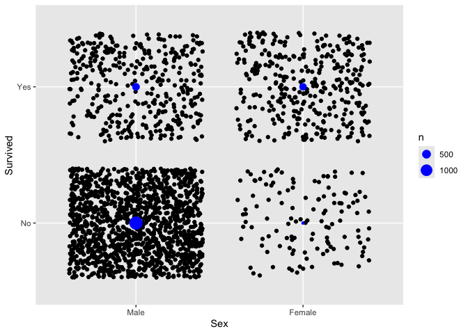

- [Toward declarative table
  generation](#toward-declarative-table-generation)
- [{tidypivot} allows you to create tables by describing them (like
  ggplot2 plotting’s
  description/declaration)](#tidypivot-allows-you-to-create-tables-by-describing-them-like-ggplot2-plottings-descriptiondeclaration)
- [declarative table creation with
  ggplot2](#declarative-table-creation-with-ggplot2)
  - [setup](#setup)
  - [declarative table build](#declarative-table-build)
  - [Status quo table creation: Harder than it should
    be?](#status-quo-table-creation-harder-than-it-should-be)
  - [Under the hood, the mechanics follow the status
    quo…](#under-the-hood-the-mechanics-follow-the-status-quo)
- [So internal helpers `data_filter`, `data_define_value`,
  `data_to_grouped`
  etc…](#so-internal-helpers-data_filter-data_define_value-data_to_grouped-etc)
- [Encapsulating steps in `pivotr()`](#encapsulating-steps-in-pivotr)
  - [Examples](#examples)
- [toward a piped workflow](#toward-a-piped-workflow)
  - [tidypivot object](#tidypivot-object)
  - [pipe-friendly user facing
    functions](#pipe-friendly-user-facing-functions)
    - [Examples](#examples-1)
- [Packaging](#packaging)
- [ggplot2 extension case study…](#ggplot2-extension-case-study)
- [examples/derivative](#examplesderivative)
- [filling cells with examples from
  data.](#filling-cells-with-examples-from-data)
- [proportions helpers](#proportions-helpers)

<!-- README.md is generated from README.Rmd. Please edit that file -->

### Toward declarative table generation

API describe layout of table (rows and cols) and compute (default to
count records)

``` r
library(tidypivot)

ggtable(tidytitanic::passengers) |>
  set_cols(sex) |>
  set_rows(survived)
```

# {tidypivot} allows you to create tables by describing them (like ggplot2 plotting’s description/declaration)

note: see original discussion here:
<https://evamaerey.github.io/mytidytuesday/2022-02-14-tables/tables.html>
and thoughtful contributions from @shannonpileggi and @brshallow
<https://github.com/EvaMaeRey/mytidytuesday/issues/3>

> And, you know, I’d get a dataset. And, *in my head I could very
> clearly kind of picture*, I want to put this on the x-axis. Let’s put
> this on the y-axis, draw a line, put some points here, break it up by
> this variable. And then, like, getting that vision out of my head, and
> into reality, it’s just really, really hard. Just, like, felt harder
> than it should be. Like, there’s a lot of custom programming involved,
> where I just felt, like, to me, I just wanted to say, like, you know,
> *this is what I’m thinking, this is how I’m picturing this plot. Like
> you’re the computer ‘Go and do it’.* … and I’d also been reading about
> the Grammar of Graphics by Leland Wilkinson, I got to meet him a
> couple of times and … I was, like, this book has been, like, written
> for me. -
> <https://www.trifacta.com/podcast/tidy-data-with-hadley-wickham/>

# declarative table creation with ggplot2

### setup

``` r
library(ggplot2)
StatSumLabel <- ggproto(`_class` = "StatSumLabel",
                        `_inherit` = StatSum,
                        default_aes = aes(label = after_stat(n)))

theme_grey(16) |>
  set_theme()
```

### declarative table build

``` r
library(ggplot2)
# 1. Declare table form
tidytitanic::tidy_titanic |>
  ggplot() + 
  aes(x = sex, # cols
      y = survived)   # rows

# 2. Now fill in the table
last_plot() + 
  geom_text(stat = StatSumLabel)  # geom_count could be used too
```



## Status quo table creation: Harder than it should be?

1.  grouping on vars anticipated to be rows and cols
2.  compute
3.  pivoting

``` r
library(dplyr)
library(tidyr)

tidytitanic::tidy_titanic |> 
  group_by(survived, 
           sex) |> 
  count() |> 
  pivot_wider(
    names_from = sex,
    values_from = n
              )
#> # A tibble: 2 × 3
#> # Groups:   survived [2]
#>   survived  Male Female
#>   <fct>    <int>  <int>
#> 1 No        1364    126
#> 2 Yes        367    344
```

## Under the hood, the mechanics follow the status quo…

- group by rows and columns
- value in data to consider (1 if not specified)
- wt, weight the value (1 if not specified)
- fun - do an operation (on value) within group

# So internal helpers `data_filter`, `data_define_value`, `data_to_grouped` etc…

<details>

``` r
data_filter <- function(data, filter){
  
  dplyr::filter(data, {{filter}})
  
}


data_define_value <- function(data, value = NULL, wt = NULL){
  
    value_quo <- rlang::enquo(value)
    wt_quo    <- rlang::enquo(wt)

      if(rlang::quo_is_null(value_quo) ){

      ## adding a value as 1 if there is none
      data <- data |>
        dplyr::mutate(value = 1)
      
    }else{
      
      data <- data |> 
          dplyr::mutate(value = {{value}})
        
    }
    
    #### weighting ####
    
    if(!rlang::quo_is_null(wt_quo) ){
     
      data <- data |>
        dplyr::mutate(value = .data$value * {{wt}}) 
   }
    
    data
  
}


data_to_grouped <- function(data, cols, rows){
  
    ### grouping by tabulation vars col and row
    data |>
      dplyr::group_by(dplyr::across(c({{cols}}, {{rows}})),
                      .drop = TRUE)
  
  
}


data_grouped_to_summarized <- function(data, fun = NULL){
  
      if(is.null(fun))  {fun <- sum}

    ## adding a value as 1 if there is none
  
    ### summarizing ####
    
    data |>
        dplyr::summarise(summary = fun(.data$value))
  
  
}


data_summarized_to_proportioned <- function(data, prop = F, percent = F, within = NULL, round = 2){ 
    # proportion case or percent
  
    within_quo        <- rlang::enquo(within)
    # totals_within_quo <- rlang::enquo(totals_within)

    if(is.null(prop)) {prop <- FALSE}

    if(prop|percent){
      
      mult <- ifelse(percent, 100, 1)
      if(is.null(round)){round <- ifelse(percent, 1, 3)}

      # prop is across all data
        if(rlang::quo_is_null(within_quo) ){

            data <- data |>
              dplyr::ungroup() |>
              dplyr::mutate(prop = round(.data$summary*mult/sum(.data$summary), round))

        # prop is within categories specified by within variable
        }else{

              data <- data |>
                dplyr::ungroup() |>
                dplyr::group_by(dplyr::across(c({{within}})),
                                .drop = FALSE) |>
                dplyr::mutate(prop = round(.data$summary*mult/sum(.data$summary), round))

        }
    }
    
  if(prop|percent){data$display <- data$prop}else{data$display <- data$summary}
  
  data

}


data_proportioned_to_pivoted <- function(data, pivot = TRUE, cols = NULL){
  
    cols_quo  <- rlang::enquo(cols)

    tidy <- data |>
      dplyr::ungroup()

    # do not pivot if argument pivot false or if no columns specified
    if(pivot == F){

      tidy 

      # otherwise pivot by columns
    }else
    
    
    if(rlang::quo_is_null(cols_quo) & pivot){
      
      tidy <- tidy |> dplyr::select(-summary)
      if(!is.null(data$prop)|!is.null(data$percent)){
        tidy <- tidy |>  dplyr::select(-prop)
      }
        
      tidy |>
        dplyr::rename(value = display)
      
    } else
      
    
    if(!rlang::quo_is_null(cols_quo) & pivot){
      # keep only display column, and tabulation vars
      tidy <- tidy |> dplyr::select(-summary)
      if(!is.null(data$prop)|!is.null(data$percent)){
        tidy <- tidy |>  dplyr::select(-prop)
      }

      tidy |>
        tidyr::pivot_wider(names_from = {{cols}}, values_from = display)

    }

  }
```

.

``` r
tidytitanic::flat_titanic |> 
  data_filter(freq > 35) |>
  data_define_value(value = freq) |> 
  data_to_grouped(rows = survived, cols = sex) |>
  data_grouped_to_summarized() |>
  data_summarized_to_proportioned(percent = T, within = survived) |>
  data_proportioned_to_pivoted(cols = sex)
#> # A tibble: 2 × 3
#>   survived  Male Female
#>   <fct>    <dbl>  <dbl>
#> 1 No        93.7   6.28
#> 2 Yes       52.3  47.7
```

</details>

# Encapsulating steps in `pivotr()`

<details>

``` r
#' @export
pivotr <- function(data,
                   rows = NULL,
                   cols = NULL,
                   
                   value = NULL,
                   wt = NULL,
                       
                   fun = NULL,
                       
                   filter = TRUE,
                   prop = FALSE,
                   percent = FALSE,
                   round = NULL,
                       
                   within = NULL,

                   pivot = TRUE
){

  data |> 
  data_filter({{filter}}) |>
  data_define_value(value = {{value}}, wt = {{wt}}) |> 
  data_to_grouped(rows = {{rows}}, cols = {{cols}}) |>
  data_grouped_to_summarized(fun = fun) |>
  data_summarized_to_proportioned(prop = prop, percent = percent, within = {{within}}, round = round) |>
  data_proportioned_to_pivoted(pivot = pivot, cols = {{cols}})
  
}
```

</details>

### Examples

``` r

tidytitanic::flat_titanic |> 
  pivotr(value = freq, 
         rows = survived, cols = sex, 
         percent = T, within = survived)
#> # A tibble: 2 × 3
#>   survived  Male Female
#>   <fct>    <dbl>  <dbl>
#> 1 No        91.5    8.5
#> 2 Yes       51.6   48.4

tidytitanic::flat_titanic |> 
  pivotr(value = freq, rows = survived, 
         cols = sex, filter = sex == "Female")
#> # A tibble: 2 × 2
#>   survived Female
#>   <fct>     <dbl>
#> 1 No          126
#> 2 Yes         344
```

``` r
library(tidytitanic)

tidy_titanic |> pivotr()
#> # A tibble: 1 × 1
#>   value
#>   <dbl>
#> 1  2201

tidy_titanic |> pivotr(rows = sex, cols = survived)
#> # A tibble: 2 × 3
#>   sex       No   Yes
#>   <fct>  <dbl> <dbl>
#> 1 Male    1364   367
#> 2 Female   126   344

tidy_titanic |> pivotr(rows = c(sex, age), cols = survived)
#> # A tibble: 4 × 4
#>   sex    age      No   Yes
#>   <fct>  <fct> <dbl> <dbl>
#> 1 Male   Child    35    29
#> 2 Male   Adult  1329   338
#> 3 Female Child    17    28
#> 4 Female Adult   109   316

tidy_titanic |> pivotr(rows = sex, cols = survived, pivot = F)
#> # A tibble: 4 × 4
#>   survived sex    summary display
#>   <fct>    <fct>    <dbl>   <dbl>
#> 1 No       Male      1364    1364
#> 2 No       Female     126     126
#> 3 Yes      Male       367     367
#> 4 Yes      Female     344     344

flat_titanic |> pivotr(rows = sex, value = freq, prop = TRUE)
#> # A tibble: 2 × 2
#>   sex    value
#>   <fct>  <dbl>
#> 1 Male   0.786
#> 2 Female 0.214

flat_titanic |> pivotr(rows = sex, cols = survived, value = freq, prop = TRUE)
#> # A tibble: 2 × 3
#>   sex       No   Yes
#>   <fct>  <dbl> <dbl>
#> 1 Male   0.62  0.167
#> 2 Female 0.057 0.156

flat_titanic |> pivotr(rows = sex, cols = survived, value = freq, prop = TRUE, within = sex)
#> # A tibble: 2 × 3
#>   sex       No   Yes
#>   <fct>  <dbl> <dbl>
#> 1 Male   0.788 0.212
#> 2 Female 0.268 0.732
```

# toward a piped workflow

## tidypivot object

<details>

<https://evamaerey.github.io/mytidytuesday/2024-07-02-s3-tables/s3-tables-tidypivot.html>

``` r
#' @export
new_tidypivot <- function(data = data.frame(),
                          rows = NULL,
                          cols = NULL,
                          value = NULL,
                          wt = NULL,
                          fun = NULL,
                          filter = TRUE,
                          prop = FALSE,
                          percent = FALSE,
                          round = NULL,
                          within = NULL,
                          pivot = TRUE) {

  # table specification components !
  tp_obj <- list(
    # data = data,
    # rows = rows,
    # cols = cols,
    # value = value,
    # wt = wt,
    # fun = fun,
    # prop = prop,
    # percent = percent,
    # round = round,
    # within = within,
    # pivot = pivot
    # # more 'slots' to be added
  )

  # declare class 'tidypivot'
  class(tp_obj) <- "tidypivot"

  # Return the created object
  invisible(tp_obj)

}

#' @export
print.tidypivot <- function(tp_obj){
  
  print(do.call(pivotr, tp_obj))
  
  invisible(tp_obj)
  
}
```

</details>

## pipe-friendly user facing functions

<details>

``` r
#' @export
ggtable <- function(data = NULL){
  
  # thedata <<- data # don't love this
  data <- data %||% data.frame()
  
  tp_obj <- new_tidypivot()
  
  tp_obj$data <- data
  
  last_tp_obj <<- tp_obj
  
  tp_obj

}


#' @export
last_table <- function(){
  
  last_tp_obj
  
}
```

``` r
# knitr::opts_chunk$set(results = "asis")
```

``` r
ggtable() 
#> # A tibble: 1 × 1
#>   value
#>   <dbl>
#> 1     0


tidytitanic::tidy_titanic |> head()
#> # A tibble: 6 × 5
#>      id class sex   age   survived
#>   <int> <fct> <fct> <fct> <fct>   
#> 1     1 3rd   Male  Child No      
#> 2     2 3rd   Male  Child No      
#> 3     3 3rd   Male  Child No      
#> 4     4 3rd   Male  Child No      
#> 5     5 3rd   Male  Child No      
#> 6     6 3rd   Male  Child No

ggtable(tidytitanic::tidy_titanic) 
#> # A tibble: 1 × 1
#>   value
#>   <dbl>
#> 1  2201


last_table()
#> # A tibble: 1 × 1
#>   value
#>   <dbl>
#> 1  2201
```

``` r
#' @export
set_rows <- function(tp_obj, rows = NULL){
  
  tp_obj$rows <- enquo(rows)
  
  last_tp_obj <<- tp_obj
  
  tp_obj

  
}


#' @export
set_cols <- function(tp_obj, cols = NULL){
  
  tp_obj$cols <- enquo(cols)

  last_tp_obj <<- tp_obj
  
  tp_obj
  

}

#' @export
set_filter <- function(tp_obj, filter = TRUE){
  
  if(!filter){tp_obj$filter <- enquo(filter)}
  
  last_tp_obj <<- tp_obj
  
  tp_obj
  

}
```

``` r
ggtable(tidytitanic::tidy_titanic) |>
  set_rows(sex) |>
  set_cols(survived) |>
  set_filter(TRUE)
#> # A tibble: 2 × 3
#>   sex       No   Yes
#>   <fct>  <dbl> <dbl>
#> 1 Male    1364   367
#> 2 Female   126   344

# last_table |>
#   set_filter(sex == "Female")
```

``` r
#' @export
set_fun <- function(tp_obj, fun = sum){

  tp_obj$fun <- fun

  last_tp_obj <<- tp_obj

  tp_obj
  
}


#' @export
set_fun_example <- function(tp_obj){

  tp_obj$fun <- function(x) sample(x, 1)


  last_tp_obj <<- tp_obj

  tp_obj
  
}


#' @export
set_fun_sample <- function(tp_obj, n = 2, sep = "; "){

  tp_obj$fun <- function(x) paste(sample(x, n, replace = F), collapse = sep)


  last_tp_obj <<- tp_obj

  tp_obj
  
}


#' @export
set_fun_list <- function(tp_obj, sep = "; "){

  tp_obj$fun <- function(x) paste(x, collapse = sep)


  last_tp_obj <<- tp_obj

  tp_obj
  
}
```

``` r
#' @export
set_value <- function(tp_obj, value = NULL){
  
  tp_obj$value <- enquo(value)

  last_tp_obj <<- tp_obj
  
  tp_obj
  
}


#' @export
set_wt <- function(tp_obj, wt = NULL){
  
  tp_obj$wt <- enquo(wt)

  last_tp_obj <<- tp_obj
  
  tp_obj
  
}


#' @export
set_weight <- function(tp_obj, weight = NULL){
  
  tp_obj$weight <- enquo(weight)
  
  last_tp_obj <<- tp_obj
  
  tp_obj
  
}
```

``` r

#' @export
calc_prop <- function(tp_obj, within = NULL){
  
  tp_obj$percent <- FALSE
  tp_obj$prop <- TRUE
  tp_obj$within <- enquo(within)
  
  last_tp_obj <<- tp_obj
  
  tp_obj
  
}

#' @export
calc_percent <- function(tp_obj, within = NULL){
  
  tp_obj$prop <- FALSE
  tp_obj$percent <- TRUE
  tp_obj$within <- enquo(within)
  
  last_tp_obj <<- tp_obj
  
  tp_obj
  
}


#' @export
set_within <- function(tp_obj, within = NULL){
  
  tp_obj$within <- enquo(within)
  
  last_tp_obj <<- tp_obj
  
  tp_obj
  
}
```

``` r
#' @export
no_pivot <- function(tp_obj){
  
  tp_obj$pivot <- FALSE

  last_tp_obj <<- tp_obj

  tp_obj  
  
}

collect <- function(tp_obj){
  
  do.call(pivotr, tp_obj)
  
}
```

</details>

### Examples

``` r
tidytitanic::passengers |> head()
#>   passenger_id title last_name first_name survived pclass    sex age sib_sp
#> 1            1   Mr.    Braund       Owen        0      3   male  22      1
#> 2            2  Mrs.   Cumings   Florence        1      1 female  38      1
#> 3            3 Miss. Heikkinen      Laina        1      3 female  26      0
#> 4            4  Mrs.  Futrelle       Lily        1      1 female  35      1
#> 5            5   Mr.     Allen    William        0      3   male  35      0
#> 6            6   Mr.     Moran      James        0      3   male  NA      0
#>   parch    fare cabin embarked           ticket            maiden_name
#> 1     0  7.2500              S        A/5 21171                   <NA>
#> 2     0 71.2833   C85        C         PC 17599 Florence Briggs Thayer
#> 3     0  7.9250              S STON/O2. 3101282                   <NA>
#> 4     0 53.1000  C123        S           113803          Lily May Peel
#> 5     0  8.0500              S           373450                   <NA>
#> 6     0  8.4583              Q           330877                   <NA>
#>                                                  name prefered_name
#> 1                             Braund, Mr. Owen Harris          <NA>
#> 2 Cumings, Mrs. John Bradley (Florence Briggs Thayer)          <NA>
#> 3                              Heikkinen, Miss. Laina          <NA>
#> 4        Futrelle, Mrs. Jacques Heath (Lily May Peel)          <NA>
#> 5                            Allen, Mr. William Henry          <NA>
#> 6                                    Moran, Mr. James          <NA>
```

``` r
ggtable(tidytitanic::passengers) |>
  set_cols(sex) |>
  set_rows(survived)
#> # A tibble: 2 × 3
#>   survived female  male
#>      <int>  <dbl> <dbl>
#> 1        0     81   734
#> 2        1    385   109

last_table() |>
  calc_percent()
#> # A tibble: 2 × 3
#>   survived female  male
#>      <int>  <dbl> <dbl>
#> 1        0    6.2  56.1
#> 2        1   29.4   8.3

last_table() |>
  calc_prop()
#> # A tibble: 2 × 3
#>   survived female  male
#>      <int>  <dbl> <dbl>
#> 1        0  0.062 0.561
#> 2        1  0.294 0.083

last_table() |>
  calc_prop(within = sex)
#> # A tibble: 2 × 3
#>   survived female  male
#>      <int>  <dbl> <dbl>
#> 1        0  0.174 0.871
#> 2        1  0.826 0.129

# a null table...
ggtable(tidytitanic::flat_titanic) |>
  set_value(NA) |>
  set_rows(sex)
#> # A tibble: 2 × 2
#>   sex    value
#>   <fct>  <int>
#> 1 Male      NA
#> 2 Female    NA

ggtable(tidytitanic::flat_titanic) |>
  set_wt(freq) |>
  set_rows(sex) |>
  set_cols(survived) 
#> # A tibble: 2 × 3
#>   sex       No   Yes
#>   <fct>  <dbl> <dbl>
#> 1 Male    1364   367
#> 2 Female   126   344

last_table() |>
  set_fun(mean)
#> # A tibble: 2 × 3
#>   sex       No   Yes
#>   <fct>  <dbl> <dbl>
#> 1 Male   170.   45.9
#> 2 Female  15.8  43

last_table() |> 
  no_pivot()
#> # A tibble: 4 × 4
#>   survived sex    summary display
#>   <fct>    <fct>    <dbl>   <dbl>
#> 1 No       Male     170.    170. 
#> 2 No       Female    15.8    15.8
#> 3 Yes      Male      45.9    45.9
#> 4 Yes      Female    43      43


last_table() |>
  collect()  # returns what would be printed as data frame
#> # A tibble: 4 × 4
#>   survived sex    summary display
#>   <fct>    <fct>    <dbl>   <dbl>
#> 1 No       Male     170.    170. 
#> 2 No       Female    15.8    15.8
#> 3 Yes      Male      45.9    45.9
#> 4 Yes      Female    43      43


ggtable(tidytitanic::flat_titanic) |>
  set_value(freq) |>
  set_rows(sex) |>
  set_fun_example()
#> # A tibble: 2 × 2
#>   sex    value
#>   <fct>  <dbl>
#> 1 Male     192
#> 2 Female    17

ggtable(tidytitanic::flat_titanic) |>
  set_value(freq) |>
  set_rows(sex) |>
  set_fun_sample(n = 3)
#> # A tibble: 2 × 2
#>   sex    value     
#>   <fct>  <chr>     
#> 1 Male   0; 14; 387
#> 2 Female 13; 0; 3

ggtable(tidytitanic::flat_titanic) |>
  set_value(freq) |>
  set_rows(sex) |>
  set_fun_list()
#> # A tibble: 2 × 2
#>   sex    value                                                         
#>   <fct>  <chr>                                                         
#> 1 Male   0; 0; 35; 0; 118; 154; 387; 670; 5; 11; 13; 0; 57; 14; 75; 192
#> 2 Female 0; 0; 17; 0; 4; 13; 89; 3; 1; 13; 14; 0; 140; 80; 76; 20
```

# Packaging

``` r
knitrExtra::chunk_names_get()

knitrExtra::chunk_to_dir("helpers")
knitrExtra::chunk_to_dir("pivotr")
knitrExtra::chunk_to_dir("tidypivot-object")
knitrExtra::chunk_to_dir("ggtable")
knitrExtra::chunk_to_dir("set-rows")
knitrExtra::chunk_to_dir("set-fun")
knitrExtra::chunk_to_dir("set-value")
knitrExtra::chunk_to_dir("set-prop")
knitrExtra::chunk_to_dir("no-pivot")
```

``` r
devtools::document()
devtools::check()
devtools::install(pkg = ".", upgrade = "never") 
```

# ggplot2 extension case study…

``` r
library(tidyverse)

ext_exports <- read_csv("https://raw.githubusercontent.com/EvaMaeRey/mytidytuesday/refs/heads/main/2024-11-19-gg-prefixes/exported_funs_exts_ggplot2_tidyverse_org.csv") |> 
  mutate(prefix = str_extract(fun_exported, ".*?_")) |> 
  mutate(prefix_long = str_extract(fun_exported, ".+_")) |> 
  mutate(ind_classic_prefix = prefix %in% c("stat_", "geom_", "theme_", "scale_", "coord_", "facet_"))


ggtable(ext_exports)
#> # A tibble: 1 × 1
#>   value
#>   <dbl>
#> 1  5527

ggtable(ext_exports |> filter(ind_classic_prefix))
#> # A tibble: 1 × 1
#>   value
#>   <dbl>
#> 1  1992

last_table() |>
  set_rows(user) 
#> # A tibble: 86 × 2
#>    user                 value
#>    <chr>                <dbl>
#>  1 AckerDWM                 2
#>  2 AllanCameron            32
#>  3 Ather-Energy             6
#>  4 IndrajeetPatil           1
#>  5 LCBC-UiO                34
#>  6 LKremer                  1
#>  7 ProjectMOSAIC            8
#>  8 PursuitOfDataScience     4
#>  9 Ryo-N7                  54
#> 10 Selbosh                  7
#> # ℹ 76 more rows

last_table() |>
  set_cols(prefix)
#> # A tibble: 86 × 7
#>    user          coord_ facet_ geom_ scale_ stat_ theme_
#>    <chr>          <dbl>  <dbl> <dbl>  <dbl> <dbl>  <dbl>
#>  1 AllanCameron       1     NA    24      6     1     NA
#>  2 cidm-ph            1     NA     4     NA     2     NA
#>  3 davidchall         1     NA     1     NA     1      2
#>  4 easystats          1     NA    14     78    NA      6
#>  5 hrbrmstr           1     NA    11     10     6      9
#>  6 stefanedwards      5      2     3      2    NA     NA
#>  7 teunbrand          2      5    11     47     7      1
#>  8 davidgohel        NA      2    50     94    NA     NA
#>  9 earowang          NA      1     1     NA     1     NA
#> 10 erocoar           NA      1    12     NA     5     NA
#> # ℹ 76 more rows

last_table() |>
  set_rows(c(user, repo))
#> # A tibble: 101 × 8
#>    user          repo         coord_ facet_ geom_ scale_ stat_ theme_
#>    <chr>         <chr>         <dbl>  <dbl> <dbl>  <dbl> <dbl>  <dbl>
#>  1 AllanCameron  geomtextpath      1     NA    24      6     1     NA
#>  2 cidm-ph       ggmapinset        1     NA     4     NA     2     NA
#>  3 davidchall    ggip              1     NA     1     NA     1      2
#>  4 easystats     see               1     NA    14     78    NA      6
#>  5 hrbrmstr      ggalt             1     NA    11     NA     6     NA
#>  6 stefanedwards lemon             5      2     3      2    NA     NA
#>  7 teunbrand     ggh4x             1      5     7      9     7     NA
#>  8 teunbrand     legendry          1     NA    NA     NA    NA      1
#>  9 davidgohel    ggiraph          NA      2    50     94    NA     NA
#> 10 earowang      sugrrants        NA      1     1     NA     1     NA
#> # ℹ 91 more rows

# last_table() |>
#   set_rows(c(user, repo))


read_csv("https://raw.githubusercontent.com/EvaMaeRey/mytidytuesday/refs/heads/main/2024-12-10-ggplot2-layer-composition/ggplot2_exported_layer_fun_composition.csv") |> 
  rename(prefix = fun_prefix) ->
ggplot2_layers_definers

ggplot2_layers_definers |>
  ggtable()
#> # A tibble: 1 × 1
#>   value
#>   <dbl>
#> 1   254

last_table() |>
  set_rows(type)
#> # A tibble: 3 × 2
#>   type     value
#>   <chr>    <dbl>
#> 1 geom        84
#> 2 position    85
#> 3 stat        85

last_table() |>
  set_rows(type) |>
  set_cols(default_or_fixed) |>
  set_rows(c(prefix, type))
#> # A tibble: 6 × 4
#>   prefix type     default fixed
#>   <chr>  <chr>      <dbl> <dbl>
#> 1 geom_  geom           2    50
#> 2 geom_  position      51     2
#> 3 geom_  stat          47     6
#> 4 stat_  geom          32    NA
#> 5 stat_  position      32    NA
#> 6 stat_  stat          NA    32
```

# examples/derivative

``` r
knitr::opts_chunk$set(results = "markup")
```

Here are some examples where you might have derivative functions

``` r
pivot_count <- function(...){

  # maybe a wt version...
  pivotr(fun = length, ...) 

  }

pivot_average <- function(...){
  
  mean_na_rm <- function(x){mean(x, na.rm = T)}
  
  pivotr(fun = mean_na_rm, ...) 
  
}

pivot_sum <- function(...){
  
  pivotr(fun = sum, ...)
  
}

pivot_empty <- function(...){
  
nar <- function(x) return(NA)

  pivotr(fun = nar, ...)

}
```

``` r
library(magrittr)
library(tidytitanic)

passengers <- readr::read_csv("https://raw.githubusercontent.com/clauswilke/dviz.supp/master/data-raw/titanic/Titanic.csv")

head(passengers)
#> # A tibble: 6 × 7
#>    ...1 Name                                 PClass   Age Sex   Survived SexCode
#>   <dbl> <chr>                                <chr>  <dbl> <chr>    <dbl>   <dbl>
#> 1     1 Allen, Miss Elisabeth Walton         1st    29    fema…        1       1
#> 2     2 Allison, Miss Helen Loraine          1st     2    fema…        0       1
#> 3     3 Allison, Mr Hudson Joshua Creighton  1st    30    male         0       0
#> 4     4 Allison, Mrs Hudson JC (Bessie Wald… 1st    25    fema…        0       1
#> 5     5 Allison, Master Hudson Trevor        1st     0.92 male         1       0
#> 6     6 Anderson, Mr Harry                   1st    47    male         1       0

tidy_titanic |> pivot_count(rows = sex)
#> # A tibble: 2 × 2
#>   sex    value
#>   <fct>  <int>
#> 1 Male    1731
#> 2 Female   470
tidy_titanic |> pivot_count(rows = sex, col = survived)
#> # A tibble: 2 × 3
#>   sex       No   Yes
#>   <fct>  <int> <int>
#> 1 Male    1364   367
#> 2 Female   126   344
flat_titanic |> pivot_sum(rows = survived, value = freq)
#> # A tibble: 2 × 2
#>   survived value
#>   <fct>    <dbl>
#> 1 No        1490
#> 2 Yes        711
flat_titanic |> pivot_sum(rows = sex,  cols = survived, value = freq)
#> # A tibble: 2 × 3
#>   sex       No   Yes
#>   <fct>  <dbl> <dbl>
#> 1 Male    1364   367
#> 2 Female   126   344

flat_titanic |> pivot_average(rows = sex,  cols = survived, value = freq)
#> # A tibble: 2 × 3
#>   sex       No   Yes
#>   <fct>  <dbl> <dbl>
#> 1 Male   170.   45.9
#> 2 Female  15.8  43
flat_titanic |> pivot_empty(rows = survived, cols = age)
#> # A tibble: 2 × 3
#>   survived Child Adult
#>   <fct>    <lgl> <lgl>
#> 1 No       NA    NA   
#> 2 Yes      NA    NA

passengers |> pivot_average(rows = c(Sex, PClass), cols = Survived, value = Age)
#> # A tibble: 7 × 4
#>   Sex    PClass   `0`   `1`
#>   <chr>  <chr>  <dbl> <dbl>
#> 1 female 1st     35.2  37.9
#> 2 female 2nd     31.4  26.9
#> 3 female 3rd     22.8  22.7
#> 4 male   *      NaN    NA  
#> 5 male   1st     44.8  34.3
#> 6 male   2nd     31.7  14.8
#> 7 male   3rd     27.1  22.1
```

# filling cells with examples from data.

``` r
pivot_example <- function(...){

  sample1 <- function(x) sample(x, 1)
  pivotr(fun = sample1, ...)

}


pivot_samplen <- function(..., n = 3, sep = "; "){

  samplen <- function(x) paste(sample(x, n, replace = F), collapse = sep)

  pivotr(fun = samplen, ...) 

}

pivot_list <- function(..., sep = "; "){

  paste_collapse <- function(x) paste (x, collapse = sep)
  pivotr(fun = paste_collapse, ...) 
  
}
```

``` r
flat_titanic |> pivot_example(rows = sex, value = freq)
#> # A tibble: 2 × 2
#>   sex    value
#>   <fct>  <dbl>
#> 1 Male      14
#> 2 Female   140

flat_titanic |> pivot_samplen(rows = sex, value = freq)
#> # A tibble: 2 × 2
#>   sex    value       
#>   <fct>  <chr>       
#> 1 Male   14; 118; 387
#> 2 Female 20; 4; 0

flat_titanic |> pivot_list(rows = sex, cols = survived, value = freq)
#> # A tibble: 2 × 3
#>   sex    No                              Yes                          
#>   <fct>  <chr>                           <chr>                        
#> 1 Male   0; 0; 35; 0; 118; 154; 387; 670 5; 11; 13; 0; 57; 14; 75; 192
#> 2 Female 0; 0; 17; 0; 4; 13; 89; 3       1; 13; 14; 0; 140; 80; 76; 20

set.seed(12345)
passengers |> pivot_example(rows = Survived, cols = Sex, value = Name)
#> # A tibble: 2 × 3
#>   Survived female                     male                          
#>      <dbl> <chr>                      <chr>                         
#> 1        0 Solvang, Mrs Lena Jacobsen Meyer, Mr August              
#> 2        1 Gibson, Miss Dorothy       Williams, Mr Richard Norris II
passengers |> pivot_samplen(rows = Survived, cols = Sex, value = Name, n = 2, sep = "; ") 
#> # A tibble: 2 × 3
#>   Survived female                                                          male 
#>      <dbl> <chr>                                                           <chr>
#> 1        0 McGowan, Miss Katherine; Klasen, Miss Gertrud Emilia            Smar…
#> 2        1 Ware, Mrs John James (Florence Louise Long); Dyker, Mrs Adolf … Mock…

passengers |> pivot_samplen(rows = Survived, cols = Sex, value = Age, n = 7) 
#> # A tibble: 2 × 3
#>   Survived female                    male                      
#>      <dbl> <chr>                     <chr>                     
#> 1        0 NA; 44; 20; NA; 18; 2; NA NA; NA; 28; NA; 19; NA; NA
#> 2        1 22; 5; 59; 12; 13; 26; NA 32; 9; 35; 60; NA; NA; NA

passengers |> dplyr::sample_n(20) |> pivot_list(rows = Sex, cols = Survived, value = Age)
#> # A tibble: 2 × 3
#>   Sex    `0`                                                `1`       
#>   <chr>  <chr>                                              <chr>     
#> 1 female NA; 30                                             NA; 45; 22
#> 2 male   NA; 24; 26; 29; 21; 29; 19; 46; 54; NA; 21; 22; NA 19; 2
```

# proportions helpers

``` r
library(tidytitanic)
# pivot_prop
flat_titanic |> pivotr(rows = sex, 
                       value = freq, 
                       prop = TRUE) # pivot_prop
#> # A tibble: 2 × 2
#>   sex    value
#>   <fct>  <dbl>
#> 1 Male   0.786
#> 2 Female 0.214

flat_titanic |> 
  pivotr(rows = sex, cols = survived, 
         value = freq, prop = TRUE)
#> # A tibble: 2 × 3
#>   sex       No   Yes
#>   <fct>  <dbl> <dbl>
#> 1 Male   0.62  0.167
#> 2 Female 0.057 0.156

flat_titanic |> 
  pivotr(rows = sex, cols = survived, 
         value = freq, prop = TRUE, within = sex)
#> # A tibble: 2 × 3
#>   sex       No   Yes
#>   <fct>  <dbl> <dbl>
#> 1 Male   0.788 0.212
#> 2 Female 0.268 0.732

# pivot_percent
flat_titanic |> 
  pivotr(rows = sex, cols = survived, 
         value = freq, percent = TRUE, within = sex)
#> # A tibble: 2 × 3
#>   sex       No   Yes
#>   <fct>  <dbl> <dbl>
#> 1 Male    78.8  21.2
#> 2 Female  26.8  73.2
```

``` r
knitr::knit_exit()
```
