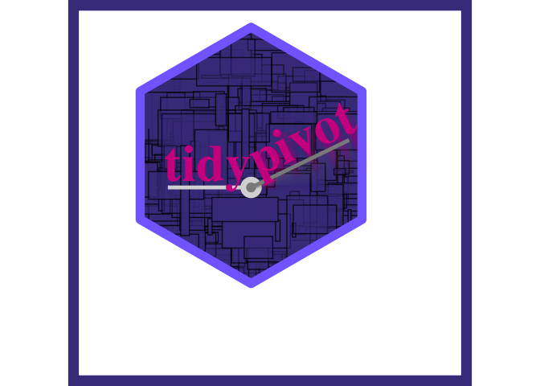

<!-- README.md is generated from README.Rmd. Please edit that file -->

``` r
library(tidypivot)
```

note: see original discussion here:
<https://evamaerey.github.io/mytidytuesday/2022-02-14-tables/tables.html>
and thoughtful contributions from @shannonpileggi and @brshallow
<https://github.com/EvaMaeRey/mytidytuesday/issues/3>

# Step 00. prep some data, records and flat data frame

``` r
library(tidyverse)
library(magrittr)

Titanic %>% 
  data.frame() %>% 
  uncount(weights = Freq) ->
tidy_titanic ; tidy_titanic %>% head()
#>   Class  Sex   Age Survived
#> 1   3rd Male Child       No
#> 2   3rd Male Child       No
#> 3   3rd Male Child       No
#> 4   3rd Male Child       No
#> 5   3rd Male Child       No
#> 6   3rd Male Child       No

Titanic %>% 
  data.frame() ->
flat_titanic ; flat_titanic %>% head()
#>   Class    Sex   Age Survived Freq
#> 1   1st   Male Child       No    0
#> 2   2nd   Male Child       No    0
#> 3   3rd   Male Child       No   35
#> 4  Crew   Male Child       No    0
#> 5   1st Female Child       No    0
#> 6   2nd Female Child       No    0
```

-----

# Step 0. Some observations

## ggplot2: user needs to describe layout of table

you can make a visual pivot table in ggplot2; analyst job is to describe
the form. How will it look

specify 3 things - start with visual layout

  - specify x
  - specify y
  - specify count type geom

<!-- end list -->

``` r
tidy_titanic %>% 
  ggplot() + 
  aes(x = Sex, y = Survived) + 
  geom_jitter() + 
  geom_count(color = "blue")
```


-----

## With existing pivot tools, description isn’t so visual

  - specify vars
  - specify aggregation
  - specify visual arrangement (names from?) \<- this comes last

<!-- end list -->

``` r
tidy_titanic %>% 
  group_by(Sex, Survived) %>% 
  summarize(count = n()) %>% 
  pivot_wider(names_from = Survived, 
              values_from = count)
#> # A tibble: 2 × 3
#> # Groups:   Sex [2]
#>   Sex       No   Yes
#>   <fct>  <int> <int>
#> 1 Male    1364   367
#> 2 Female   126   344
```

-----

# Step 1a. Make Functions to allow description of final table, pivot\_count and pivot\_calc

## x argument is horizontal elements (columns) and y is vertical elements (rows)

``` r
pivot_count_script <- readLines("./R/pivot_count.R")
```

``` r
#' Title
#'
#' @param data A data frame, data frame extension (e.g. a tibble), or a lazy data frame (e.g. from dbplyr or dtplyr). See Methods, below, for more details.
#' @param cols a character vector of items
#' @param rows a character vector of items
#' @param pivot logical: should wide table be returned - col categories as columns (TRUE), or left long and tidy (FALSE)?
#'
#' @return
#' @export
#'
#' @examples
#' tidy_titanic %>% pivot_count(rows = sex)
#' tidy_titanic %>% pivot_count(cols = sex)
#' tidy_titanic %>% pivot_count(rows = survived, cols = sex)
#' tidy_titanic %>% pivot_count(rows = c(survived, sex), cols = age)
#' tidy_titanic %>% pivot_count(rows = c(survived), cols = c(age, sex))
#' tidy_titanic %>% pivot_count(cols = c(survived), rows = c(age, sex, class))
#' tidy_titanic %>% pivot_count(rows = c(survived, sex), cols = age, pivot = FALSE)
#' flat_titanic %>% pivot_count(rows = sex, wt = freq)
pivot_count <- function(data, cols = NULL,
                        rows = NULL, pivot = TRUE, wt = NULL){

  fun <- sum # this will be a variable in pivot_calc

  # allow for default behaviors under null
  cols_quo <- rlang::enquo(cols)
  wt_quo <- rlang::enquo(wt)

  # declare grouping
  grouped <- data %>%
    dplyr::group_by(dplyr::across(c({{cols}}, {{rows}})),
                    .drop = FALSE)

  # behavior if no wt
  if(rlang::quo_is_null(wt_quo)){
  summarized <- grouped %>%
    dplyr::mutate(value = 1) %>%
    dplyr::summarize(value = fun(value))

  # behavior with wt
  }else{
  summarized <- grouped %>%
    dplyr::summarise(value = fun({{wt}}))

  }

  # placeholder for arrangement
  arranged <- summarized

  # ungrouping, preserving unpivoted object
  tidy <- arranged %>%
    dplyr::ungroup()

  # do not pivot if argument pivot false or if no columns specified
  if(pivot == F | rlang::quo_is_null(cols_quo)){

    tidy %>%
      dplyr::rename(count = .data$value)

  # otherwise pivot by columns
  }else{

  tidy %>%
    tidyr::pivot_wider(names_from = {{cols}})

  }

}
```

``` r
pivot_calc_script <- readLines("./R/pivot_calc.R")
```

``` r
#' Title
#'
#' @inheritParams pivot_count
#'
#' @return
#' @export
#'
#' @examples
#' flat_titanic %>% pivot_calc(rows = sex, value = freq)
#' flat_titanic %>% pivot_calc(rows = sex, fun = mean, value = freq)
pivot_calc <- function(data, rows = NULL, cols = NULL,
                       value = NULL,
                       fun = sum,
                       pivot = T
){

    cols_quo <- rlang::enquo(cols)
    value_quo <- rlang::enquo(value)

    grouped <- data %>%
      dplyr::group_by(dplyr::across(c({{cols}}, {{rows}})),
                      .drop = FALSE)

    if(rlang::quo_is_null(value_quo)){
      summarized <- grouped %>%
        dplyr::summarize(value = dplyr::n())
    }else{
      summarized <- grouped %>%
        dplyr::summarise(value = fun({{value}}))

    }

    arranged <- summarized

    ungrouped <- arranged %>%
      dplyr::ungroup()

    tidy <- ungrouped

    # do not pivot if argument pivot false or if no columns specified
    if(pivot == F | rlang::quo_is_null(cols_quo)){

      tidy %>%
        dplyr::rename(count = .data$value)

      # otherwise pivot by columns
    }else{

      tidy %>%
        tidyr::pivot_wider(names_from = {{cols}})

    }

  }
```

# Step 1b. Using those functions

``` r
# rows and cols
tidy_titanic %>% 
  pivot_count(rows = Survived, cols = Sex) 
#> # A tibble: 2 × 3
#>   Survived  Male Female
#>   <fct>    <dbl>  <dbl>
#> 1 No        1364    126
#> 2 Yes        367    344

# cols only
tidy_titanic %>% 
   pivot_count(cols = Sex)
#> # A tibble: 1 × 2
#>    Male Female
#>   <dbl>  <dbl>
#> 1  1731    470

# rows only
tidy_titanic %>% 
  pivot_count(rows = Survived) 
#> # A tibble: 2 × 2
#>   Survived count
#>   <fct>    <dbl>
#> 1 No        1490
#> 2 Yes        711

# two rows and col
tidy_titanic %>% 
  pivot_count(rows = c(Survived, Class), cols = Sex)
#> # A tibble: 8 × 4
#>   Survived Class  Male Female
#>   <fct>    <fct> <dbl>  <dbl>
#> 1 No       1st     118      4
#> 2 No       2nd     154     13
#> 3 No       3rd     422    106
#> 4 No       Crew    670      3
#> 5 Yes      1st      62    141
#> 6 Yes      2nd      25     93
#> 7 Yes      3rd      88     90
#> 8 Yes      Crew    192     20

# two rows and col and contains zero counts
tidy_titanic %>% 
  pivot_count(rows = c(Survived, Class), cols = c(Sex, Age))
#> # A tibble: 8 × 6
#>   Survived Class Male_Child Male_Adult Female_Child Female_Adult
#>   <fct>    <fct>      <dbl>      <dbl>        <dbl>        <dbl>
#> 1 No       1st            0        118            0            4
#> 2 No       2nd            0        154            0           13
#> 3 No       3rd           35        387           17           89
#> 4 No       Crew           0        670            0            3
#> 5 Yes      1st            5         57            1          140
#> 6 Yes      2nd           11         14           13           80
#> 7 Yes      3rd           13         75           14           76
#> 8 Yes      Crew           0        192            0           20

# two rows and col and contains zero counts
tidy_titanic %>% 
  pivot_count(rows = c(Survived, Class), cols = c(Sex, Age), pivot = F)
#> # A tibble: 32 × 5
#>    Sex   Age   Survived Class count
#>    <fct> <fct> <fct>    <fct> <dbl>
#>  1 Male  Child No       1st       0
#>  2 Male  Child No       2nd       0
#>  3 Male  Child No       3rd      35
#>  4 Male  Child No       Crew      0
#>  5 Male  Child Yes      1st       5
#>  6 Male  Child Yes      2nd      11
#>  7 Male  Child Yes      3rd      13
#>  8 Male  Child Yes      Crew      0
#>  9 Male  Adult No       1st     118
#> 10 Male  Adult No       2nd     154
#> # … with 22 more rows

# count all
tidy_titanic %>% 
   pivot_count()
#> # A tibble: 1 × 1
#>   count
#>   <dbl>
#> 1  2201

# for fun organize like it will appear visually in code
tidy_titanic %>% 
  pivot_count(                          cols = Sex, 
              rows = c(Survived, Class)        )
#> # A tibble: 8 × 4
#>   Survived Class  Male Female
#>   <fct>    <fct> <dbl>  <dbl>
#> 1 No       1st     118      4
#> 2 No       2nd     154     13
#> 3 No       3rd     422    106
#> 4 No       Crew    670      3
#> 5 Yes      1st      62    141
#> 6 Yes      2nd      25     93
#> 7 Yes      3rd      88     90
#> 8 Yes      Crew    192     20
```

## After examining your table you might actually want to have the calculation in long form (for use in something like ggplot2). This is what pivot = F is for\!

``` r
tidy_titanic %>% 
  pivot_count(cols = Sex, rows = Survived, pivot = F)
#> # A tibble: 4 × 3
#>   Sex    Survived count
#>   <fct>  <fct>    <dbl>
#> 1 Male   No        1364
#> 2 Male   Yes        367
#> 3 Female No         126
#> 4 Female Yes        344
```

## 1b. pivot\_calc using pivot calc function for non count aggregation

### just for fun arrange the code how the table will look

``` r
flat_titanic %>%
  pivot_calc(              cols = Sex, 
             rows = Survived, value = Freq, fun = sum)
#> # A tibble: 2 × 3
#>   Survived  Male Female
#>   <fct>    <dbl>  <dbl>
#> 1 No        1364    126
#> 2 Yes        367    344

flat_titanic %>% 
  pivot_count(cols = Sex, 
             rows = Survived, wt = Freq)
#> # A tibble: 2 × 3
#>   Survived  Male Female
#>   <fct>    <dbl>  <dbl>
#> 1 No        1364    126
#> 2 Yes        367    344
```

Issue: For this case, we should probably use pivot\_count and allow for
a wt argument.

## 1b style. use another tool to style

### goal of functions is not to style - just to make calculation faster by using a visually driven API

``` r
tidy_titanic %>%  
  pivot_count(cols = Sex, rows = c(Survived, Class)) %>% 
  group_by(Class) %>% 
  gt::gt()
```

<div id="jhgqijzcnm" style="padding-left:0px;padding-right:0px;padding-top:10px;padding-bottom:10px;overflow-x:auto;overflow-y:auto;width:auto;height:auto;">
<style>html {
  font-family: -apple-system, BlinkMacSystemFont, 'Segoe UI', Roboto, Oxygen, Ubuntu, Cantarell, 'Helvetica Neue', 'Fira Sans', 'Droid Sans', Arial, sans-serif;
}

#jhgqijzcnm .gt_table {
  display: table;
  border-collapse: collapse;
  margin-left: auto;
  margin-right: auto;
  color: #333333;
  font-size: 16px;
  font-weight: normal;
  font-style: normal;
  background-color: #FFFFFF;
  width: auto;
  border-top-style: solid;
  border-top-width: 2px;
  border-top-color: #A8A8A8;
  border-right-style: none;
  border-right-width: 2px;
  border-right-color: #D3D3D3;
  border-bottom-style: solid;
  border-bottom-width: 2px;
  border-bottom-color: #A8A8A8;
  border-left-style: none;
  border-left-width: 2px;
  border-left-color: #D3D3D3;
}

#jhgqijzcnm .gt_heading {
  background-color: #FFFFFF;
  text-align: center;
  border-bottom-color: #FFFFFF;
  border-left-style: none;
  border-left-width: 1px;
  border-left-color: #D3D3D3;
  border-right-style: none;
  border-right-width: 1px;
  border-right-color: #D3D3D3;
}

#jhgqijzcnm .gt_caption {
  padding-top: 4px;
  padding-bottom: 4px;
}

#jhgqijzcnm .gt_title {
  color: #333333;
  font-size: 125%;
  font-weight: initial;
  padding-top: 4px;
  padding-bottom: 4px;
  padding-left: 5px;
  padding-right: 5px;
  border-bottom-color: #FFFFFF;
  border-bottom-width: 0;
}

#jhgqijzcnm .gt_subtitle {
  color: #333333;
  font-size: 85%;
  font-weight: initial;
  padding-top: 0;
  padding-bottom: 6px;
  padding-left: 5px;
  padding-right: 5px;
  border-top-color: #FFFFFF;
  border-top-width: 0;
}

#jhgqijzcnm .gt_bottom_border {
  border-bottom-style: solid;
  border-bottom-width: 2px;
  border-bottom-color: #D3D3D3;
}

#jhgqijzcnm .gt_col_headings {
  border-top-style: solid;
  border-top-width: 2px;
  border-top-color: #D3D3D3;
  border-bottom-style: solid;
  border-bottom-width: 2px;
  border-bottom-color: #D3D3D3;
  border-left-style: none;
  border-left-width: 1px;
  border-left-color: #D3D3D3;
  border-right-style: none;
  border-right-width: 1px;
  border-right-color: #D3D3D3;
}

#jhgqijzcnm .gt_col_heading {
  color: #333333;
  background-color: #FFFFFF;
  font-size: 100%;
  font-weight: normal;
  text-transform: inherit;
  border-left-style: none;
  border-left-width: 1px;
  border-left-color: #D3D3D3;
  border-right-style: none;
  border-right-width: 1px;
  border-right-color: #D3D3D3;
  vertical-align: bottom;
  padding-top: 5px;
  padding-bottom: 6px;
  padding-left: 5px;
  padding-right: 5px;
  overflow-x: hidden;
}

#jhgqijzcnm .gt_column_spanner_outer {
  color: #333333;
  background-color: #FFFFFF;
  font-size: 100%;
  font-weight: normal;
  text-transform: inherit;
  padding-top: 0;
  padding-bottom: 0;
  padding-left: 4px;
  padding-right: 4px;
}

#jhgqijzcnm .gt_column_spanner_outer:first-child {
  padding-left: 0;
}

#jhgqijzcnm .gt_column_spanner_outer:last-child {
  padding-right: 0;
}

#jhgqijzcnm .gt_column_spanner {
  border-bottom-style: solid;
  border-bottom-width: 2px;
  border-bottom-color: #D3D3D3;
  vertical-align: bottom;
  padding-top: 5px;
  padding-bottom: 5px;
  overflow-x: hidden;
  display: inline-block;
  width: 100%;
}

#jhgqijzcnm .gt_group_heading {
  padding-top: 8px;
  padding-bottom: 8px;
  padding-left: 5px;
  padding-right: 5px;
  color: #333333;
  background-color: #FFFFFF;
  font-size: 100%;
  font-weight: initial;
  text-transform: inherit;
  border-top-style: solid;
  border-top-width: 2px;
  border-top-color: #D3D3D3;
  border-bottom-style: solid;
  border-bottom-width: 2px;
  border-bottom-color: #D3D3D3;
  border-left-style: none;
  border-left-width: 1px;
  border-left-color: #D3D3D3;
  border-right-style: none;
  border-right-width: 1px;
  border-right-color: #D3D3D3;
  vertical-align: middle;
  text-align: left;
}

#jhgqijzcnm .gt_empty_group_heading {
  padding: 0.5px;
  color: #333333;
  background-color: #FFFFFF;
  font-size: 100%;
  font-weight: initial;
  border-top-style: solid;
  border-top-width: 2px;
  border-top-color: #D3D3D3;
  border-bottom-style: solid;
  border-bottom-width: 2px;
  border-bottom-color: #D3D3D3;
  vertical-align: middle;
}

#jhgqijzcnm .gt_from_md > :first-child {
  margin-top: 0;
}

#jhgqijzcnm .gt_from_md > :last-child {
  margin-bottom: 0;
}

#jhgqijzcnm .gt_row {
  padding-top: 8px;
  padding-bottom: 8px;
  padding-left: 5px;
  padding-right: 5px;
  margin: 10px;
  border-top-style: solid;
  border-top-width: 1px;
  border-top-color: #D3D3D3;
  border-left-style: none;
  border-left-width: 1px;
  border-left-color: #D3D3D3;
  border-right-style: none;
  border-right-width: 1px;
  border-right-color: #D3D3D3;
  vertical-align: middle;
  overflow-x: hidden;
}

#jhgqijzcnm .gt_stub {
  color: #333333;
  background-color: #FFFFFF;
  font-size: 100%;
  font-weight: initial;
  text-transform: inherit;
  border-right-style: solid;
  border-right-width: 2px;
  border-right-color: #D3D3D3;
  padding-left: 5px;
  padding-right: 5px;
}

#jhgqijzcnm .gt_stub_row_group {
  color: #333333;
  background-color: #FFFFFF;
  font-size: 100%;
  font-weight: initial;
  text-transform: inherit;
  border-right-style: solid;
  border-right-width: 2px;
  border-right-color: #D3D3D3;
  padding-left: 5px;
  padding-right: 5px;
  vertical-align: top;
}

#jhgqijzcnm .gt_row_group_first td {
  border-top-width: 2px;
}

#jhgqijzcnm .gt_summary_row {
  color: #333333;
  background-color: #FFFFFF;
  text-transform: inherit;
  padding-top: 8px;
  padding-bottom: 8px;
  padding-left: 5px;
  padding-right: 5px;
}

#jhgqijzcnm .gt_first_summary_row {
  border-top-style: solid;
  border-top-color: #D3D3D3;
}

#jhgqijzcnm .gt_first_summary_row.thick {
  border-top-width: 2px;
}

#jhgqijzcnm .gt_last_summary_row {
  padding-top: 8px;
  padding-bottom: 8px;
  padding-left: 5px;
  padding-right: 5px;
  border-bottom-style: solid;
  border-bottom-width: 2px;
  border-bottom-color: #D3D3D3;
}

#jhgqijzcnm .gt_grand_summary_row {
  color: #333333;
  background-color: #FFFFFF;
  text-transform: inherit;
  padding-top: 8px;
  padding-bottom: 8px;
  padding-left: 5px;
  padding-right: 5px;
}

#jhgqijzcnm .gt_first_grand_summary_row {
  padding-top: 8px;
  padding-bottom: 8px;
  padding-left: 5px;
  padding-right: 5px;
  border-top-style: double;
  border-top-width: 6px;
  border-top-color: #D3D3D3;
}

#jhgqijzcnm .gt_striped {
  background-color: rgba(128, 128, 128, 0.05);
}

#jhgqijzcnm .gt_table_body {
  border-top-style: solid;
  border-top-width: 2px;
  border-top-color: #D3D3D3;
  border-bottom-style: solid;
  border-bottom-width: 2px;
  border-bottom-color: #D3D3D3;
}

#jhgqijzcnm .gt_footnotes {
  color: #333333;
  background-color: #FFFFFF;
  border-bottom-style: none;
  border-bottom-width: 2px;
  border-bottom-color: #D3D3D3;
  border-left-style: none;
  border-left-width: 2px;
  border-left-color: #D3D3D3;
  border-right-style: none;
  border-right-width: 2px;
  border-right-color: #D3D3D3;
}

#jhgqijzcnm .gt_footnote {
  margin: 0px;
  font-size: 90%;
  padding-left: 4px;
  padding-right: 4px;
  padding-left: 5px;
  padding-right: 5px;
}

#jhgqijzcnm .gt_sourcenotes {
  color: #333333;
  background-color: #FFFFFF;
  border-bottom-style: none;
  border-bottom-width: 2px;
  border-bottom-color: #D3D3D3;
  border-left-style: none;
  border-left-width: 2px;
  border-left-color: #D3D3D3;
  border-right-style: none;
  border-right-width: 2px;
  border-right-color: #D3D3D3;
}

#jhgqijzcnm .gt_sourcenote {
  font-size: 90%;
  padding-top: 4px;
  padding-bottom: 4px;
  padding-left: 5px;
  padding-right: 5px;
}

#jhgqijzcnm .gt_left {
  text-align: left;
}

#jhgqijzcnm .gt_center {
  text-align: center;
}

#jhgqijzcnm .gt_right {
  text-align: right;
  font-variant-numeric: tabular-nums;
}

#jhgqijzcnm .gt_font_normal {
  font-weight: normal;
}

#jhgqijzcnm .gt_font_bold {
  font-weight: bold;
}

#jhgqijzcnm .gt_font_italic {
  font-style: italic;
}

#jhgqijzcnm .gt_super {
  font-size: 65%;
}

#jhgqijzcnm .gt_footnote_marks {
  font-style: italic;
  font-weight: normal;
  font-size: 75%;
  vertical-align: 0.4em;
}

#jhgqijzcnm .gt_asterisk {
  font-size: 100%;
  vertical-align: 0;
}

#jhgqijzcnm .gt_indent_1 {
  text-indent: 5px;
}

#jhgqijzcnm .gt_indent_2 {
  text-indent: 10px;
}

#jhgqijzcnm .gt_indent_3 {
  text-indent: 15px;
}

#jhgqijzcnm .gt_indent_4 {
  text-indent: 20px;
}

#jhgqijzcnm .gt_indent_5 {
  text-indent: 25px;
}
</style>
<table class="gt_table">
  
  <thead class="gt_col_headings">
    <tr>
      <th class="gt_col_heading gt_columns_bottom_border gt_center" rowspan="1" colspan="1" scope="col" id="Survived">Survived</th>
      <th class="gt_col_heading gt_columns_bottom_border gt_right" rowspan="1" colspan="1" scope="col" id="Male">Male</th>
      <th class="gt_col_heading gt_columns_bottom_border gt_right" rowspan="1" colspan="1" scope="col" id="Female">Female</th>
    </tr>
  </thead>
  <tbody class="gt_table_body">
    <tr class="gt_group_heading_row">
      <th colspan="3" class="gt_group_heading" scope="colgroup" id="1st">1st</th>
    </tr>
    <tr class="gt_row_group_first"><td headers="1st  Survived" class="gt_row gt_center">No</td>
<td headers="1st  Male" class="gt_row gt_right">118</td>
<td headers="1st  Female" class="gt_row gt_right">4</td></tr>
    <tr><td headers="1st  Survived" class="gt_row gt_center">Yes</td>
<td headers="1st  Male" class="gt_row gt_right">62</td>
<td headers="1st  Female" class="gt_row gt_right">141</td></tr>
    <tr class="gt_group_heading_row">
      <th colspan="3" class="gt_group_heading" scope="colgroup" id="2nd">2nd</th>
    </tr>
    <tr class="gt_row_group_first"><td headers="2nd  Survived" class="gt_row gt_center">No</td>
<td headers="2nd  Male" class="gt_row gt_right">154</td>
<td headers="2nd  Female" class="gt_row gt_right">13</td></tr>
    <tr><td headers="2nd  Survived" class="gt_row gt_center">Yes</td>
<td headers="2nd  Male" class="gt_row gt_right">25</td>
<td headers="2nd  Female" class="gt_row gt_right">93</td></tr>
    <tr class="gt_group_heading_row">
      <th colspan="3" class="gt_group_heading" scope="colgroup" id="3rd">3rd</th>
    </tr>
    <tr class="gt_row_group_first"><td headers="3rd  Survived" class="gt_row gt_center">No</td>
<td headers="3rd  Male" class="gt_row gt_right">422</td>
<td headers="3rd  Female" class="gt_row gt_right">106</td></tr>
    <tr><td headers="3rd  Survived" class="gt_row gt_center">Yes</td>
<td headers="3rd  Male" class="gt_row gt_right">88</td>
<td headers="3rd  Female" class="gt_row gt_right">90</td></tr>
    <tr class="gt_group_heading_row">
      <th colspan="3" class="gt_group_heading" scope="colgroup" id="Crew">Crew</th>
    </tr>
    <tr class="gt_row_group_first"><td headers="Crew  Survived" class="gt_row gt_center">No</td>
<td headers="Crew  Male" class="gt_row gt_right">670</td>
<td headers="Crew  Female" class="gt_row gt_right">3</td></tr>
    <tr><td headers="Crew  Survived" class="gt_row gt_center">Yes</td>
<td headers="Crew  Male" class="gt_row gt_right">192</td>
<td headers="Crew  Female" class="gt_row gt_right">20</td></tr>
  </tbody>
  
  
</table>
</div>

``` r
tidy_titanic %>% 
  pivot_count(cols = Sex, rows = c(Survived, Class, Age)) %>% 
  group_by(Age) %>% 
  gt::gt()
```

<div id="yjvbdwyefq" style="padding-left:0px;padding-right:0px;padding-top:10px;padding-bottom:10px;overflow-x:auto;overflow-y:auto;width:auto;height:auto;">
<style>html {
  font-family: -apple-system, BlinkMacSystemFont, 'Segoe UI', Roboto, Oxygen, Ubuntu, Cantarell, 'Helvetica Neue', 'Fira Sans', 'Droid Sans', Arial, sans-serif;
}

#yjvbdwyefq .gt_table {
  display: table;
  border-collapse: collapse;
  margin-left: auto;
  margin-right: auto;
  color: #333333;
  font-size: 16px;
  font-weight: normal;
  font-style: normal;
  background-color: #FFFFFF;
  width: auto;
  border-top-style: solid;
  border-top-width: 2px;
  border-top-color: #A8A8A8;
  border-right-style: none;
  border-right-width: 2px;
  border-right-color: #D3D3D3;
  border-bottom-style: solid;
  border-bottom-width: 2px;
  border-bottom-color: #A8A8A8;
  border-left-style: none;
  border-left-width: 2px;
  border-left-color: #D3D3D3;
}

#yjvbdwyefq .gt_heading {
  background-color: #FFFFFF;
  text-align: center;
  border-bottom-color: #FFFFFF;
  border-left-style: none;
  border-left-width: 1px;
  border-left-color: #D3D3D3;
  border-right-style: none;
  border-right-width: 1px;
  border-right-color: #D3D3D3;
}

#yjvbdwyefq .gt_caption {
  padding-top: 4px;
  padding-bottom: 4px;
}

#yjvbdwyefq .gt_title {
  color: #333333;
  font-size: 125%;
  font-weight: initial;
  padding-top: 4px;
  padding-bottom: 4px;
  padding-left: 5px;
  padding-right: 5px;
  border-bottom-color: #FFFFFF;
  border-bottom-width: 0;
}

#yjvbdwyefq .gt_subtitle {
  color: #333333;
  font-size: 85%;
  font-weight: initial;
  padding-top: 0;
  padding-bottom: 6px;
  padding-left: 5px;
  padding-right: 5px;
  border-top-color: #FFFFFF;
  border-top-width: 0;
}

#yjvbdwyefq .gt_bottom_border {
  border-bottom-style: solid;
  border-bottom-width: 2px;
  border-bottom-color: #D3D3D3;
}

#yjvbdwyefq .gt_col_headings {
  border-top-style: solid;
  border-top-width: 2px;
  border-top-color: #D3D3D3;
  border-bottom-style: solid;
  border-bottom-width: 2px;
  border-bottom-color: #D3D3D3;
  border-left-style: none;
  border-left-width: 1px;
  border-left-color: #D3D3D3;
  border-right-style: none;
  border-right-width: 1px;
  border-right-color: #D3D3D3;
}

#yjvbdwyefq .gt_col_heading {
  color: #333333;
  background-color: #FFFFFF;
  font-size: 100%;
  font-weight: normal;
  text-transform: inherit;
  border-left-style: none;
  border-left-width: 1px;
  border-left-color: #D3D3D3;
  border-right-style: none;
  border-right-width: 1px;
  border-right-color: #D3D3D3;
  vertical-align: bottom;
  padding-top: 5px;
  padding-bottom: 6px;
  padding-left: 5px;
  padding-right: 5px;
  overflow-x: hidden;
}

#yjvbdwyefq .gt_column_spanner_outer {
  color: #333333;
  background-color: #FFFFFF;
  font-size: 100%;
  font-weight: normal;
  text-transform: inherit;
  padding-top: 0;
  padding-bottom: 0;
  padding-left: 4px;
  padding-right: 4px;
}

#yjvbdwyefq .gt_column_spanner_outer:first-child {
  padding-left: 0;
}

#yjvbdwyefq .gt_column_spanner_outer:last-child {
  padding-right: 0;
}

#yjvbdwyefq .gt_column_spanner {
  border-bottom-style: solid;
  border-bottom-width: 2px;
  border-bottom-color: #D3D3D3;
  vertical-align: bottom;
  padding-top: 5px;
  padding-bottom: 5px;
  overflow-x: hidden;
  display: inline-block;
  width: 100%;
}

#yjvbdwyefq .gt_group_heading {
  padding-top: 8px;
  padding-bottom: 8px;
  padding-left: 5px;
  padding-right: 5px;
  color: #333333;
  background-color: #FFFFFF;
  font-size: 100%;
  font-weight: initial;
  text-transform: inherit;
  border-top-style: solid;
  border-top-width: 2px;
  border-top-color: #D3D3D3;
  border-bottom-style: solid;
  border-bottom-width: 2px;
  border-bottom-color: #D3D3D3;
  border-left-style: none;
  border-left-width: 1px;
  border-left-color: #D3D3D3;
  border-right-style: none;
  border-right-width: 1px;
  border-right-color: #D3D3D3;
  vertical-align: middle;
  text-align: left;
}

#yjvbdwyefq .gt_empty_group_heading {
  padding: 0.5px;
  color: #333333;
  background-color: #FFFFFF;
  font-size: 100%;
  font-weight: initial;
  border-top-style: solid;
  border-top-width: 2px;
  border-top-color: #D3D3D3;
  border-bottom-style: solid;
  border-bottom-width: 2px;
  border-bottom-color: #D3D3D3;
  vertical-align: middle;
}

#yjvbdwyefq .gt_from_md > :first-child {
  margin-top: 0;
}

#yjvbdwyefq .gt_from_md > :last-child {
  margin-bottom: 0;
}

#yjvbdwyefq .gt_row {
  padding-top: 8px;
  padding-bottom: 8px;
  padding-left: 5px;
  padding-right: 5px;
  margin: 10px;
  border-top-style: solid;
  border-top-width: 1px;
  border-top-color: #D3D3D3;
  border-left-style: none;
  border-left-width: 1px;
  border-left-color: #D3D3D3;
  border-right-style: none;
  border-right-width: 1px;
  border-right-color: #D3D3D3;
  vertical-align: middle;
  overflow-x: hidden;
}

#yjvbdwyefq .gt_stub {
  color: #333333;
  background-color: #FFFFFF;
  font-size: 100%;
  font-weight: initial;
  text-transform: inherit;
  border-right-style: solid;
  border-right-width: 2px;
  border-right-color: #D3D3D3;
  padding-left: 5px;
  padding-right: 5px;
}

#yjvbdwyefq .gt_stub_row_group {
  color: #333333;
  background-color: #FFFFFF;
  font-size: 100%;
  font-weight: initial;
  text-transform: inherit;
  border-right-style: solid;
  border-right-width: 2px;
  border-right-color: #D3D3D3;
  padding-left: 5px;
  padding-right: 5px;
  vertical-align: top;
}

#yjvbdwyefq .gt_row_group_first td {
  border-top-width: 2px;
}

#yjvbdwyefq .gt_summary_row {
  color: #333333;
  background-color: #FFFFFF;
  text-transform: inherit;
  padding-top: 8px;
  padding-bottom: 8px;
  padding-left: 5px;
  padding-right: 5px;
}

#yjvbdwyefq .gt_first_summary_row {
  border-top-style: solid;
  border-top-color: #D3D3D3;
}

#yjvbdwyefq .gt_first_summary_row.thick {
  border-top-width: 2px;
}

#yjvbdwyefq .gt_last_summary_row {
  padding-top: 8px;
  padding-bottom: 8px;
  padding-left: 5px;
  padding-right: 5px;
  border-bottom-style: solid;
  border-bottom-width: 2px;
  border-bottom-color: #D3D3D3;
}

#yjvbdwyefq .gt_grand_summary_row {
  color: #333333;
  background-color: #FFFFFF;
  text-transform: inherit;
  padding-top: 8px;
  padding-bottom: 8px;
  padding-left: 5px;
  padding-right: 5px;
}

#yjvbdwyefq .gt_first_grand_summary_row {
  padding-top: 8px;
  padding-bottom: 8px;
  padding-left: 5px;
  padding-right: 5px;
  border-top-style: double;
  border-top-width: 6px;
  border-top-color: #D3D3D3;
}

#yjvbdwyefq .gt_striped {
  background-color: rgba(128, 128, 128, 0.05);
}

#yjvbdwyefq .gt_table_body {
  border-top-style: solid;
  border-top-width: 2px;
  border-top-color: #D3D3D3;
  border-bottom-style: solid;
  border-bottom-width: 2px;
  border-bottom-color: #D3D3D3;
}

#yjvbdwyefq .gt_footnotes {
  color: #333333;
  background-color: #FFFFFF;
  border-bottom-style: none;
  border-bottom-width: 2px;
  border-bottom-color: #D3D3D3;
  border-left-style: none;
  border-left-width: 2px;
  border-left-color: #D3D3D3;
  border-right-style: none;
  border-right-width: 2px;
  border-right-color: #D3D3D3;
}

#yjvbdwyefq .gt_footnote {
  margin: 0px;
  font-size: 90%;
  padding-left: 4px;
  padding-right: 4px;
  padding-left: 5px;
  padding-right: 5px;
}

#yjvbdwyefq .gt_sourcenotes {
  color: #333333;
  background-color: #FFFFFF;
  border-bottom-style: none;
  border-bottom-width: 2px;
  border-bottom-color: #D3D3D3;
  border-left-style: none;
  border-left-width: 2px;
  border-left-color: #D3D3D3;
  border-right-style: none;
  border-right-width: 2px;
  border-right-color: #D3D3D3;
}

#yjvbdwyefq .gt_sourcenote {
  font-size: 90%;
  padding-top: 4px;
  padding-bottom: 4px;
  padding-left: 5px;
  padding-right: 5px;
}

#yjvbdwyefq .gt_left {
  text-align: left;
}

#yjvbdwyefq .gt_center {
  text-align: center;
}

#yjvbdwyefq .gt_right {
  text-align: right;
  font-variant-numeric: tabular-nums;
}

#yjvbdwyefq .gt_font_normal {
  font-weight: normal;
}

#yjvbdwyefq .gt_font_bold {
  font-weight: bold;
}

#yjvbdwyefq .gt_font_italic {
  font-style: italic;
}

#yjvbdwyefq .gt_super {
  font-size: 65%;
}

#yjvbdwyefq .gt_footnote_marks {
  font-style: italic;
  font-weight: normal;
  font-size: 75%;
  vertical-align: 0.4em;
}

#yjvbdwyefq .gt_asterisk {
  font-size: 100%;
  vertical-align: 0;
}

#yjvbdwyefq .gt_indent_1 {
  text-indent: 5px;
}

#yjvbdwyefq .gt_indent_2 {
  text-indent: 10px;
}

#yjvbdwyefq .gt_indent_3 {
  text-indent: 15px;
}

#yjvbdwyefq .gt_indent_4 {
  text-indent: 20px;
}

#yjvbdwyefq .gt_indent_5 {
  text-indent: 25px;
}
</style>
<table class="gt_table">
  
  <thead class="gt_col_headings">
    <tr>
      <th class="gt_col_heading gt_columns_bottom_border gt_center" rowspan="1" colspan="1" scope="col" id="Survived">Survived</th>
      <th class="gt_col_heading gt_columns_bottom_border gt_center" rowspan="1" colspan="1" scope="col" id="Class">Class</th>
      <th class="gt_col_heading gt_columns_bottom_border gt_right" rowspan="1" colspan="1" scope="col" id="Male">Male</th>
      <th class="gt_col_heading gt_columns_bottom_border gt_right" rowspan="1" colspan="1" scope="col" id="Female">Female</th>
    </tr>
  </thead>
  <tbody class="gt_table_body">
    <tr class="gt_group_heading_row">
      <th colspan="4" class="gt_group_heading" scope="colgroup" id="Child">Child</th>
    </tr>
    <tr class="gt_row_group_first"><td headers="Child  Survived" class="gt_row gt_center">No</td>
<td headers="Child  Class" class="gt_row gt_center">1st</td>
<td headers="Child  Male" class="gt_row gt_right">0</td>
<td headers="Child  Female" class="gt_row gt_right">0</td></tr>
    <tr><td headers="Child  Survived" class="gt_row gt_center">No</td>
<td headers="Child  Class" class="gt_row gt_center">2nd</td>
<td headers="Child  Male" class="gt_row gt_right">0</td>
<td headers="Child  Female" class="gt_row gt_right">0</td></tr>
    <tr><td headers="Child  Survived" class="gt_row gt_center">No</td>
<td headers="Child  Class" class="gt_row gt_center">3rd</td>
<td headers="Child  Male" class="gt_row gt_right">35</td>
<td headers="Child  Female" class="gt_row gt_right">17</td></tr>
    <tr><td headers="Child  Survived" class="gt_row gt_center">No</td>
<td headers="Child  Class" class="gt_row gt_center">Crew</td>
<td headers="Child  Male" class="gt_row gt_right">0</td>
<td headers="Child  Female" class="gt_row gt_right">0</td></tr>
    <tr><td headers="Child  Survived" class="gt_row gt_center">Yes</td>
<td headers="Child  Class" class="gt_row gt_center">1st</td>
<td headers="Child  Male" class="gt_row gt_right">5</td>
<td headers="Child  Female" class="gt_row gt_right">1</td></tr>
    <tr><td headers="Child  Survived" class="gt_row gt_center">Yes</td>
<td headers="Child  Class" class="gt_row gt_center">2nd</td>
<td headers="Child  Male" class="gt_row gt_right">11</td>
<td headers="Child  Female" class="gt_row gt_right">13</td></tr>
    <tr><td headers="Child  Survived" class="gt_row gt_center">Yes</td>
<td headers="Child  Class" class="gt_row gt_center">3rd</td>
<td headers="Child  Male" class="gt_row gt_right">13</td>
<td headers="Child  Female" class="gt_row gt_right">14</td></tr>
    <tr><td headers="Child  Survived" class="gt_row gt_center">Yes</td>
<td headers="Child  Class" class="gt_row gt_center">Crew</td>
<td headers="Child  Male" class="gt_row gt_right">0</td>
<td headers="Child  Female" class="gt_row gt_right">0</td></tr>
    <tr class="gt_group_heading_row">
      <th colspan="4" class="gt_group_heading" scope="colgroup" id="Adult">Adult</th>
    </tr>
    <tr class="gt_row_group_first"><td headers="Adult  Survived" class="gt_row gt_center">No</td>
<td headers="Adult  Class" class="gt_row gt_center">1st</td>
<td headers="Adult  Male" class="gt_row gt_right">118</td>
<td headers="Adult  Female" class="gt_row gt_right">4</td></tr>
    <tr><td headers="Adult  Survived" class="gt_row gt_center">No</td>
<td headers="Adult  Class" class="gt_row gt_center">2nd</td>
<td headers="Adult  Male" class="gt_row gt_right">154</td>
<td headers="Adult  Female" class="gt_row gt_right">13</td></tr>
    <tr><td headers="Adult  Survived" class="gt_row gt_center">No</td>
<td headers="Adult  Class" class="gt_row gt_center">3rd</td>
<td headers="Adult  Male" class="gt_row gt_right">387</td>
<td headers="Adult  Female" class="gt_row gt_right">89</td></tr>
    <tr><td headers="Adult  Survived" class="gt_row gt_center">No</td>
<td headers="Adult  Class" class="gt_row gt_center">Crew</td>
<td headers="Adult  Male" class="gt_row gt_right">670</td>
<td headers="Adult  Female" class="gt_row gt_right">3</td></tr>
    <tr><td headers="Adult  Survived" class="gt_row gt_center">Yes</td>
<td headers="Adult  Class" class="gt_row gt_center">1st</td>
<td headers="Adult  Male" class="gt_row gt_right">57</td>
<td headers="Adult  Female" class="gt_row gt_right">140</td></tr>
    <tr><td headers="Adult  Survived" class="gt_row gt_center">Yes</td>
<td headers="Adult  Class" class="gt_row gt_center">2nd</td>
<td headers="Adult  Male" class="gt_row gt_right">14</td>
<td headers="Adult  Female" class="gt_row gt_right">80</td></tr>
    <tr><td headers="Adult  Survived" class="gt_row gt_center">Yes</td>
<td headers="Adult  Class" class="gt_row gt_center">3rd</td>
<td headers="Adult  Male" class="gt_row gt_right">75</td>
<td headers="Adult  Female" class="gt_row gt_right">76</td></tr>
    <tr><td headers="Adult  Survived" class="gt_row gt_center">Yes</td>
<td headers="Adult  Class" class="gt_row gt_center">Crew</td>
<td headers="Adult  Male" class="gt_row gt_right">192</td>
<td headers="Adult  Female" class="gt_row gt_right">20</td></tr>
  </tbody>
  
  
</table>
</div>

# Back to Step 0, Observations: use existing tools to calculate *proportions* is many step process

### feels like lots of gymnastics… a vis first approach is what we are after

``` r
tidy_titanic %>% 
  group_by(Sex, Survived) %>% 
  summarize(value = n()) %>% 
  group_by(Sex) %>% 
  mutate(prop = value/sum(value)) %>% 
  select(-value) %>% 
  pivot_wider(values_from = prop, names_from = Sex)
#> # A tibble: 2 × 3
#>   Survived  Male Female
#>   <fct>    <dbl>  <dbl>
#> 1 No       0.788  0.268
#> 2 Yes      0.212  0.732
```

# Step 2a. build a function where visual arrangement leads.

``` r
pivot_prop_script <- readLines("./R/pivot_prop.R")
```

``` r
#' Title
#'
#' @inheritParams pivot_count
#'
#' @return
#' @export
#'
#' @examples
#' tidy_titanic %>% pivot_prop(rows = sex, cols = survived, within = sex)
pivot_prop <- function(data, rows = NULL, cols = NULL,
                       value = NULL, fun = sum,
                       within = NULL,  pivot = T,
                       percent = T, round = F){

  cols_quo <- rlang::enquo(cols)
  value_quo <- rlang::enquo(value)

  if(rlang::quo_is_null(value_quo)){
    data <- data %>% dplyr::mutate(value = 1)
  }else{
    data <- data %>%
      dplyr::mutate(value = fun({{value}}))
  }

  data %>%
    dplyr::group_by(across(c({{rows}}, {{cols}})), .drop = FALSE) %>%
    dplyr::summarize(value = fun(value)) %>%
    dplyr::group_by(across(c({{within}}))) %>%
    dplyr::mutate(prop = (value/sum(value)*ifelse(percent, 100, 1)) %>% round(1)) %>%
    dplyr::select(-value) %>%
    dplyr::ungroup() ->
  tidy

  if(pivot){

    tidy %>%
      tidyr::pivot_wider(values_from = prop, names_from = {{cols}})

  }else{

    tidy
  }

}
```

# Step 2b. using the pivot\_prop

``` r
tidy_titanic %>% 
  pivot_prop(rows = Survived, cols = Class, within = Class)
#> # A tibble: 2 × 5
#>   Survived `1st` `2nd` `3rd`  Crew
#>   <fct>    <dbl> <dbl> <dbl> <dbl>
#> 1 No        37.5  58.6  74.8    76
#> 2 Yes       62.5  41.4  25.2    24

tidy_titanic %>% 
  pivot_prop(rows = c(Survived, Sex), 
               cols = Class, 
               within = Survived)
#> # A tibble: 4 × 6
#>   Survived Sex    `1st` `2nd` `3rd`  Crew
#>   <fct>    <fct>  <dbl> <dbl> <dbl> <dbl>
#> 1 No       Male     7.9  10.3  28.3  45  
#> 2 No       Female   0.3   0.9   7.1   0.2
#> 3 Yes      Male     8.7   3.5  12.4  27  
#> 4 Yes      Female  19.8  13.1  12.7   2.8

tidy_titanic %>% 
  pivot_prop(rows = c(Survived, Sex), 
               cols = Class, 
               within = c(Survived, Sex))
#> # A tibble: 4 × 6
#>   Survived Sex    `1st` `2nd` `3rd`  Crew
#>   <fct>    <fct>  <dbl> <dbl> <dbl> <dbl>
#> 1 No       Male     8.7  11.3  30.9  49.1
#> 2 No       Female   3.2  10.3  84.1   2.4
#> 3 Yes      Male    16.9   6.8  24    52.3
#> 4 Yes      Female  41    27    26.2   5.8
```

``` r
tidy_titanic %>% 
  pivot_prop(rows = c(Survived, Sex), 
               cols = Class, 
               within = Survived, pivot = F) %>% 
  ggplot() +
  aes(x = Class, y = Sex) +
  facet_grid(rows = vars(Survived)) +
  geom_tile() +
  aes(fill = prop) + 
  geom_text(aes(label = prop %>% round(3)))
```


``` r
tidy_titanic %>% 
  pivot_prop(rows = c(Survived, Sex), 
               cols = Class, 
               within = c(Survived, Sex), pivot = F) %>% 
  ggplot() +
  aes(x = Class, y = 1) +
  facet_grid(rows = vars(Survived, Sex)) +
  geom_tile() +
  aes(fill = prop) + 
  geom_text(aes(label = prop %>% round(3)))
```


# Reflections, questions, issues

1.  Does this already exist?
2.  ~~How can API improve? possibly rows = vars(y00, y0, y), cols =
    vars(x). and within = vars(?, ?) This requires more digging into
    tidy eval. What about multiple x vars?~~ These changes implemented
    thanks to Brian and Shannon
3.  ~~How can internals improve? Also tidy eval is old I think. defaults
    for missing data.~~ Using new {{}} tidy eval within and across, and
    rlang::quo\_is\_null() thanks to Brian
4.  What about summary columns, rows. Column totals, etc. Maybe not very
    tidy… maybe allowed w/ error message.
5.  Ideas about different API - more like ggplot2, where you would
    specify new dimensions of your table after piping. Would require
    function to create non-data frame type object. Not sure about
    consistency dplyr/tidyr tools. These just return dataframes/tibble.
    I think being consistent with that expectation might be a good
    thing. Also less challenging to implement.


# Other work in this space

  - janitor::tably
  - pivottabler

-----

# Piping

``` r
library(tidypivot)

tp_init(data = "tidytitanic::tidy_titanic"); str(my_tp)
#> # A tibble: 1 × 1
#>   value
#>   <dbl>
#> 1  2201
#> Classes 'Tidypivot', 'R6' <Tidypivot>
#>   Public:
#>     clone: function (deep = FALSE) 
#>     cols: NULL
#>     data: tidytitanic::tidy_titanic
#>     fun: NULL
#>     out: tidypivot::pivot_helper(tidytitanic::tidy_titanic, NULL, ...
#>     pivot: NULL
#>     print: function () 
#>     rows: NULL
#>     update: function (data = NULL, rows = NULL, cols = NULL, fun = NULL, 
#>     value: NULL
#>     within: NULL
#>     withinfun: NULL
#>     wrap: NULL
#>     wt: NULL
   tp_add(rows = "sex"); str(my_tp)
#> # A tibble: 2 × 2
#>   sex    value
#>   <fct>  <dbl>
#> 1 Male    1731
#> 2 Female   470
#> Classes 'Tidypivot', 'R6' <Tidypivot>
#>   Public:
#>     clone: function (deep = FALSE) 
#>     cols: NULL
#>     data: tidytitanic::tidy_titanic
#>     fun: NULL
#>     out: tidypivot::pivot_helper(tidytitanic::tidy_titanic, sex,  ...
#>     pivot: NULL
#>     print: function () 
#>     rows: sex
#>     update: function (data = NULL, rows = NULL, cols = NULL, fun = NULL, 
#>     value: NULL
#>     within: NULL
#>     withinfun: NULL
#>     wrap: NULL
#>     wt: NULL
   tp_add(cols = "survived"); str(my_tp)
#> # A tibble: 2 × 3
#>   sex       No   Yes
#>   <fct>  <dbl> <dbl>
#> 1 Male    1364   367
#> 2 Female   126   344
#> Classes 'Tidypivot', 'R6' <Tidypivot>
#>   Public:
#>     clone: function (deep = FALSE) 
#>     cols: survived
#>     data: tidytitanic::tidy_titanic
#>     fun: NULL
#>     out: tidypivot::pivot_helper(tidytitanic::tidy_titanic, sex,  ...
#>     pivot: NULL
#>     print: function () 
#>     rows: sex
#>     update: function (data = NULL, rows = NULL, cols = NULL, fun = NULL, 
#>     value: NULL
#>     within: NULL
#>     withinfun: NULL
#>     wrap: NULL
#>     wt: NULL
   tp_add(cols = "c(survived, class)"); str(my_tp)
#> # A tibble: 2 × 9
#>   sex    No_1st No_2nd No_3rd No_Crew Yes_1st Yes_2nd Yes_3rd Yes_Crew
#>   <fct>   <dbl>  <dbl>  <dbl>   <dbl>   <dbl>   <dbl>   <dbl>    <dbl>
#> 1 Male      118    154    422     670      62      25      88      192
#> 2 Female      4     13    106       3     141      93      90       20
#> Classes 'Tidypivot', 'R6' <Tidypivot>
#>   Public:
#>     clone: function (deep = FALSE) 
#>     cols: c(survived, class)
#>     data: tidytitanic::tidy_titanic
#>     fun: NULL
#>     out: tidypivot::pivot_helper(tidytitanic::tidy_titanic, sex,  ...
#>     pivot: NULL
#>     print: function () 
#>     rows: sex
#>     update: function (data = NULL, rows = NULL, cols = NULL, fun = NULL, 
#>     value: NULL
#>     within: NULL
#>     withinfun: NULL
#>     wrap: NULL
#>     wt: NULL
```

``` r
tp_init_pipe(data = "tidytitanic::tidy_titanic") |> 
   tp_add(cols = "class")   ; str(my_tp)
#> # A tibble: 2 × 5
#>   sex    `1st` `2nd` `3rd`  Crew
#>   <fct>  <dbl> <dbl> <dbl> <dbl>
#> 1 Male     180   179   510   862
#> 2 Female   145   106   196    23
#> Classes 'Tidypivot', 'R6' <Tidypivot>
#>   Public:
#>     clone: function (deep = FALSE) 
#>     cols: class
#>     data: tidytitanic::tidy_titanic
#>     fun: NULL
#>     out: tidypivot::pivot_helper(tidytitanic::tidy_titanic, sex,  ...
#>     pivot: NULL
#>     print: function () 
#>     rows: sex
#>     update: function (data = NULL, rows = NULL, cols = NULL, fun = NULL, 
#>     value: NULL
#>     within: NULL
#>     withinfun: NULL
#>     wrap: NULL
#>     wt: NULL
```

# Alternate interface?

``` r
ls()
#> [1] "flat_titanic"       "my_tp"              "pivot_calc"        
#> [4] "pivot_calc_script"  "pivot_count"        "pivot_count_script"
#> [7] "pivot_prop"         "pivot_prop_script"  "tidy_titanic"

set_data(tidytitanic::tidy_titanic) |> 
   set_rows(sex) |>
   set_cols(survived) |>
   set_cols(c(survived, age))
#> # A tibble: 2 × 5
#>   sex    No_Child No_Adult Yes_Child Yes_Adult
#>   <fct>     <dbl>    <dbl>     <dbl>     <dbl>
#> 1 Male         35     1329        29       338
#> 2 Female       17      109        28       316
```

-----

# And back again…

How to create a scatterplot with a pivot table

``` r
library(ggplot2)
anscombe %>% 
  ggplot() + 
  aes(x = rank(x1), y = rank(y1)) + 
  geom_point() + 
  scale_y_continuous(breaks = 1:12 -.5) + 
  scale_x_continuous(breaks = 1:12 -.5) +
  theme(panel.grid.minor = element_blank())
```



``` r
# or

anscombe %>% 
  pivot_count(cols = x1, rows = y1) %>% 
  dplyr::arrange(-y1) %>% 
  knitr::kable()
```

|    y1 |  4 |  5 |  6 |  7 |  8 |  9 | 10 | 11 | 12 | 13 | 14 |
| ----: | -: | -: | -: | -: | -: | -: | -: | -: | -: | -: | -: |
| 10.84 | NA | NA | NA | NA | NA | NA | NA | NA |  1 | NA | NA |
|  9.96 | NA | NA | NA | NA | NA | NA | NA | NA | NA | NA |  1 |
|  8.81 | NA | NA | NA | NA | NA |  1 | NA | NA | NA | NA | NA |
|  8.33 | NA | NA | NA | NA | NA | NA | NA |  1 | NA | NA | NA |
|  8.04 | NA | NA | NA | NA | NA | NA |  1 | NA | NA | NA | NA |
|  7.58 | NA | NA | NA | NA | NA | NA | NA | NA | NA |  1 | NA |
|  7.24 | NA | NA |  1 | NA | NA | NA | NA | NA | NA | NA | NA |
|  6.95 | NA | NA | NA | NA |  1 | NA | NA | NA | NA | NA | NA |
|  5.68 | NA |  1 | NA | NA | NA | NA | NA | NA | NA | NA | NA |
|  4.82 | NA | NA | NA |  1 | NA | NA | NA | NA | NA | NA | NA |
|  4.26 |  1 | NA | NA | NA | NA | NA | NA | NA | NA | NA | NA |

``` r
"tidy_titanic %>% 
  group_by(Sex, Survived) %>% 
  summarize(count = n()) %>% 
  pivot_wider(names_from = Survived, 
              values_from = count)" %>% 
  writeLines(con = tempfile()) 


ggstamp::ggdraft() + 
  ggstamp::stamp_text(label = "tidy_titanic %>% 
  group_by(Sex, Survived) %>% 
  summarize(count = n()) %>% 
  pivot_wider(names_from = Survived, 
              values_from = count)",
  hjust = 0, size = 8, x = .01, y = .4)
```


``` r

ggstamp::ggcanvas() + 
  ggstamp::stamp_circle(x0y0 = ggstamp::pos_polygon(n = 3),
                        fill = "green", alpha = .2, radius = 1.3) +
  ggstamp::stamp_text(xy = ggstamp::pos_polygon(n = 3, radius = 1.5),
                      label = c("ggplot2", "tidyr", "dplyr"))
```


